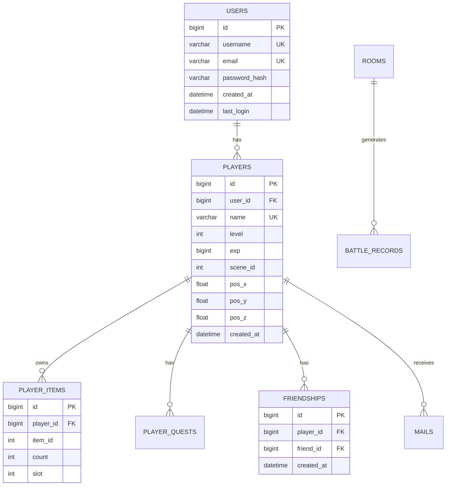

# 游戏服务器框架 - 架构设计文档

> [!IMPORTANT]
> 本文档详细说明游戏服务器的系统架构、模块设计、数据库设计和部署方案。

---

## 📋 文档信息

| 项目 | 内容 |
|------|------|
| **项目名称** | SuperSocket MMO 游戏服务器框架 |
| **文档类型** | 架构设计文档 |
| **文档版本** | v1.0 |
| **创建时间** | 2026-02-06 |

---

## 🏛️ 系统总体架构

### 五层架构图

```mermaid
graph TB
    subgraph 客户端层
        Unity[Unity 客户端<br/>后续开发]
    end
    
    subgraph 接入层
        TCP[TCP Server<br/>Port: 33333]
        UDP[UDP Server<br/>Port: 33334]
        KCP[KCP Server<br/>Port: 33335<br/>可选]
    end
    
    subgraph 网关层
        Gateway[Gateway Layer<br/>协议路由 | 认证 | 加密]
    end
    
    subgraph 业务层
        PlayerMgr[PlayerManager<br/>玩家管理]
        WorldMgr[WorldManager<br/>大世界系统]
        RoomMgr[RoomManager<br/>房间系统]
        SocialMgr[SocialManager<br/>社交系统]
        DataMgr[DataManager<br/>数据系统]
    end
    
    subgraph 数据层
        MySQL[(MySQL 5.7<br/>持久化数据)]
        Redis[(Redis 7.x<br/>缓存/会话)]
    end
    
    subgraph 基础设施层
        Log[Serilog<br/>日志]
        Monitor[Prometheus<br/>监控]
        GM[GM Tool<br/>管理后台]
    end
    
    Unity -->|TCP/UDP/KCP| TCP
    Unity -->|TCP/UDP/KCP| UDP
    Unity -->|TCP/UDP/KCP| KCP
    
    TCP --> Gateway
    UDP --> Gateway
    KCP --> Gateway
    
    Gateway --> PlayerMgr
    Gateway --> WorldMgr
    Gateway --> RoomMgr
    Gateway --> SocialMgr
    Gateway --> DataMgr
    
    PlayerMgr --> MySQL
    WorldMgr --> MySQL
    RoomMgr --> MySQL
    SocialMgr --> MySQL
    DataMgr --> MySQL
    
    PlayerMgr --> Redis
    WorldMgr --> Redis
    RoomMgr --> Redis
    SocialMgr --> Redis
    
    PlayerMgr -.-> Log
    WorldMgr -.-> Log
    RoomMgr -.-> Log
    
    Monitor -.监控.-> PlayerMgr
    Monitor -.监控.-> WorldMgr
    
    GM -.管理.-> PlayerMgr
```

---

## 🌐 网络层架构设计

### 1. 接入层设计

#### TCP Server

**职责**: 可靠通信（登录、聊天、交易等）

**实现**:
```csharp
public class TcpGameServer : SuperSocketServer<TcpSession, GamePackage>
{
    protected override void ConfigureServer(ServerOptions options)
    {
        options.Listeners = new[]
        {
            new ListenOptions
            {
                Ip = "0.0.0.0",
                Port = 33333,
                NoDelay = true,      // 禁用 Nagle
                BackLog = 100,
                KeepAlive = true
            }
        };
        
        options.MaxConnectionNumber = 1500;  // 2C2G 限制
        options.ReceiveTimeout = TimeSpan.FromMinutes(5);
    }
}
```

**协议格式**:
```
┌────────────┬────────────┬────────────┬────────────┐
│  Length    │  Message   │  Sequence  │  Payload   │
│  (4 bytes) │  ID        │  Number    │  (Protobuf)│
│            │  (2 bytes) │  (4 bytes) │            │
└────────────┴────────────┴────────────┴────────────┘
```

---

#### UDP Server

**职责**: 快速通道（帧同步、移动同步）

**实现**:
```csharp
public class UdpGameServer : SuperSocketServer<UdpSession, GamePackage>
{
    // UDP 不保证可靠性
    // 适合实时数据，最新数据覆盖旧数据
}
```

**使用场景**:
- 帧同步输入（15fps = 66ms/帧）
- 玩家移动（10fps = 100ms/次）
- 战斗特效

---

#### Session 管理

```csharp
public class GameSession : AppSession
{
    // 会话信息
    public long PlayerId { get; set; }
    public string Token { get; set; }
    public bool IsAuthenticated { get; set; }
    
    // 最后活跃时间
    public DateTime LastActiveTime { get; set; }
    
    // 消息序列号（防重放）
    public long LastSequence { get; set; }
    
    // 协议路由
    protected override async ValueTask OnPackageReceivedAsync(GamePackage package)
    {
        LastActiveTime = DateTime.UtcNow;
        
        // 验证序列号
        if (package.Sequence <= LastSequence)
        {
            return; // 丢弃重放消息
        }
        LastSequence = package.Sequence;
        
        // 路由到 Gateway
        await Gateway.RouteMessageAsync(this, package);
    }
}
```

---

### 2. 网关层设计

#### 消息路由

```csharp
public class MessageGateway
{
    private readonly Dictionary<ushort, IMessageHandler> _handlers = new();
    
    public void RegisterHandler(ushort msgId, IMessageHandler handler)
    {
        _handlers[msgId] = handler;
    }
    
    public async Task RouteMessageAsync(GameSession session, GamePackage package)
    {
        // 认证检查
        if (!session.IsAuthenticated && package.MessageId != MsgId.Login)
        {
            await session.SendErrorAsync(ErrorCode.NotAuthenticated);
            return;
        }
        
        // 查找处理器
        if (!_handlers.TryGetValue(package.MessageId, out var handler))
        {
            _logger.LogWarning($"Unknown message: {package.MessageId}");
            return;
        }
        
        // 执行处理
        await handler.HandleAsync(session, package.Payload);
    }
}
```

---

#### 消息处理器接口

```csharp
public interface IMessageHandler
{
    Task HandleAsync(GameSession session, byte[] payload);
}

// 示例：登录处理器
public class LoginHandler : IMessageHandler
{
    public async Task HandleAsync(GameSession session, byte[] payload)
    {
        // 反序列化
        var req = C2S_Login.Parser.ParseFrom(payload);
        
        // 业务逻辑
        var (success, player) = await _authService.LoginAsync(
            req.Username, req.Password);
        
        // 响应
        var resp = new S2C_Login
        {
            Code = success ? 0 : (int)ErrorCode.LoginFailed,
            Token = player?.Token,
            Player = player?.ToProto()
        };
        
        await session.SendAsync(MsgId.Login, resp);
    }
}
```

---

## 🎮 业务层架构设计

### 1. 模块划分

```
BusinessLayer/
├── Player/              # 玩家模块
│   ├── PlayerManager.cs
│   ├── PlayerService.cs
│   └── Player.cs
├── World/               # 大世界模块
│   ├── WorldManager.cs
│   ├── Scene.cs
│   ├── AOI/
│   │   ├── Grid9AOI.cs
│   │   └── Entity.cs
│   └── Movement/
│       └── MovementValidator.cs
├── Room/                # 房间模块
│   ├── RoomManager.cs
│   ├── Room.cs
│   ├── FrameSync/
│   │   ├── LockstepEngine.cs
│   │   └── FrameBuffer.cs
│   └── Match/
│       └── MatchmakingService.cs
├── Social/              # 社交模块
│   ├── ChatService.cs
│   ├── FriendService.cs
│   ├── LeaderboardService.cs
│   └── MailService.cs
└── Data/                # 数据模块
    ├── InventoryService.cs
    ├── QuestService.cs
    └── AchievementService.cs
```

---

### 2. PlayerManager 设计

```csharp
public class PlayerManager : ISingletonService
{
    // 在线玩家（内存）
    private readonly ConcurrentDictionary<long, Player> _onlinePlayers = new();
    
    // 添加玩家
    public void AddPlayer(Player player)
    {
        _onlinePlayers[player.Id] = player;
        
        // 更新 Redis
        _ = _redis.HashSetAsync("online:players", player.Id, player.SessionId);
        
        // 监控指标
        OnlinePlayersGauge.Set(_onlinePlayers.Count);
    }
    
    // 移除玩家
    public async Task RemovePlayerAsync(long playerId)
    {
        if (_onlinePlayers.TryRemove(playerId, out var player))
        {
            // 保存数据
            await player.SaveAsync();
            
            // 从场景移除
            player.CurrentScene?.RemovePlayer(player);
            
            // 更新 Redis
            await _redis.HashDeleteAsync("online:players", playerId);
            
            OnlinePlayersGauge.Set(_onlinePlayers.Count);
        }
    }
    
    // 获取玩家
    public Player GetPlayer(long playerId)
    {
        return _onlinePlayers.GetValueOrDefault(playerId);
    }
}
```

---

### 3. WorldManager 设计（状态同步）

#### Scene 场景

```csharp
public class Scene
{
    public int SceneId { get; set; }
    public string Name { get; set; }
    
    // AOI 管理器
    private readonly Grid9AOI _aoi;
    
    // 场景内实体
    private readonly ConcurrentDictionary<long, Entity> _entities = new();
    
    // 添加玩家
    public void AddPlayer(Player player)
    {
        var entity = new PlayerEntity(player);
        _entities[player.Id] = entity;
        _aoi.Enter(entity);
        
        // 广播进入视野
        BroadcastEnterAOI(entity);
    }
    
    // 玩家移动
    public void OnPlayerMove(long playerId, Vector3 position, Vector3 direction)
    {
        if (!_entities.TryGetValue(playerId, out var entity))
            return;
        
        // 验证移动合法性
        if (!MovementValidator.Validate(entity, position))
        {
            // 拉回客户端
           _logger.LogWarning($"Invalid movement: {playerId}");
            return;
        }
        
        // 更新位置
        var oldPos = entity.Position;
        entity.Position = position;
        
        // 更新 AOI
        _aoi.UpdatePosition(entity, oldPos, position);
        
        // 广播给视野内玩家
        BroadcastMovement(entity);
    }
}
```

---

#### Grid9 AOI 算法

```csharp
public class Grid9AOI
{
    private const int GridSize = 50;  // 每格 50 米
    private readonly Dictionary<(int, int), HashSet<Entity>> _grids = new();
    
    // 进入 AOI
    public void Enter(Entity entity)
    {
        var grid = GetGrid(entity.Position);
        GetOrCreateGrid(grid).Add(entity);
        entity.CurrentGrid = grid;
    }
    
    // 获取视野内实体
    public List<Entity> GetEntitiesInAOI(Entity entity)
    {
        var result = new List<Entity>();
        var (gx, gy) = entity.CurrentGrid;
        
        // 九宫格
        for (int dx = -1; dx <= 1; dx++)
        {
            for (int dy = -1; dy <= 1; dy++)
            {
                var grid = (gx + dx, gy + dy);
                if (_grids.TryGetValue(grid, out var entities))
                {
                    result.AddRange(entities.Where(e => 
                        e != entity && 
                        Vector3.Distance(e.Position, entity.Position) <= 50));
                }
            }
        }
        
        return result;
    }
}
```

---

### 4. RoomManager 设计（帧同步）

#### Room 房间

```csharp
public class Room
{
    public int RoomId { get; set; }
    public RoomState State { get; set; }  // Waiting, Preparing, Fighting, Ended
    
    // 房间内玩家
    private readonly List<RoomPlayer> _players = new();
    
    // 帧同步引擎
    private readonly LockstepEngine _lockstep;
    
    // 当前帧号
    private int _currentFrame = 0;
    
    // 开始战斗
    public void StartBattle()
    {
        State = RoomState.Fighting;
        _currentFrame = 0;
        
        // 启动帧同步
        _lockstep.Start(UpdateFrame, frameRate: 15);  // 15fps
    }
    
    // 接收玩家输入
    public void ReceivePlayerInput(long playerId, int frame, byte[] input)
    {
        _lockstep.AddInput(playerId, frame, input);
    }
    
    // 每帧更新
    private void UpdateFrame(int frame, Dictionary<long, byte[]> inputs)
    {
        _currentFrame = frame;
        
        // 广播帧数据给所有玩家
        var frameData = new S2C_FrameData
        {
            Frame = frame,
            Inputs = { inputs.Select(kv => new PlayerInput
            {
                PlayerId = kv.Key,
                Data = ByteString.CopyFrom(kv.Value)
            })}
        };
        
        BroadcastToAll(MsgId.FrameData, frameData);
    }
}
```

---

#### Lockstep 引擎

```csharp
public class LockstepEngine
{
    private const int FrameRate = 15;  // 15fps
    private const int FrameMs = 1000 / FrameRate;  // 66ms
    
    // 帧输入缓冲
    private readonly Dictionary<int, Dictionary<long, byte[]>> _frameInputs = new();
    
    // 玩家列表
    private readonly List<long> _playerIds;
    
    private Timer _timer;
    
    public void Start(Action<int, Dictionary<long, byte[]>> onFrame, int frameRate = 15)
    {
        _timer = new Timer(_ =>
        {
            _currentFrame++;
            
            // 收集当前帧的所有玩家输入
            var inputs = GetFrameInputs(_currentFrame);
            
            // 执行帧逻辑
            onFrame(_currentFrame, inputs);
            
            // 清理旧帧
            CleanOldFrames();
            
        }, null, 0, FrameMs);
    }
    
    public void AddInput(long playerId, int frame, byte[] input)
    {
        if (!_frameInputs.ContainsKey(frame))
            _frameInputs[frame] = new Dictionary<long, byte[]>();
        
        _frameInputs[frame][playerId] = input;
    }
    
    private Dictionary<long, byte[]> GetFrameInputs(int frame)
    {
        if (_frameInputs.TryGetValue(frame, out var inputs))
            return inputs;
        
        // 如果某个玩家没有输入，使用空输入
        var result = new Dictionary<long, byte[]>();
        foreach (var playerId in _playerIds)
        {
            result[playerId] = inputs?.GetValueOrDefault(playerId) ?? Array.Empty<byte>();
        }
        return result;
    }
}
```

---

### 5. ChatService 设计

```csharp
public class ChatService
{
    private readonly IRedisClient _redis;
    
    // 发送聊天消息
    public async Task SendMessageAsync(ChatMessage msg)
    {
        // 敏感词过滤
        msg.Content = await FilterSensitiveWordsAsync(msg.Content);
        
        // 冷却检查
        if (!await CheckCooldownAsync(msg.SenderId, msg.Channel))
        {
            throw new GameException(ErrorCode.ChatCooldown);
        }
        
        // 保存到 Redis（最近 100 条）
        await _redis.ListLeftPushAsync($"chat:{msg.Channel}", msg.ToJson());
        await _redis.ListTrimAsync($"chat:{msg.Channel}", 0, 99);
        
        // 广播
        switch (msg.Channel)
        {
            case ChatChannel.World:
                BroadcastToWorld(msg);
                break;
            case ChatChannel.Scene:
                BroadcastToScene(msg.SceneId, msg);
                break;
            case ChatChannel.Private:
                SendToPlayer(msg.ReceiverId, msg);
                break;
        }
        
        // 保存到 MySQL（异步）
        _ = SaveToDatabaseAsync(msg);
    }
}
```

---

## 💾 数据层设计

### 1. 数据库设计

#### ER 图



---

#### 核心表设计

**users 用户表**:
```sql
CREATE TABLE `users` (
  `id` BIGINT AUTO_INCREMENT PRIMARY KEY,
  `username` VARCHAR(32) NOT NULL UNIQUE,
  `email` VARCHAR(100) UNIQUE,
  `password_hash` VARCHAR(100) NOT NULL,
  `created_at` DATETIME DEFAULT CURRENT_TIMESTAMP,
  `last_login` DATETIME,
  INDEX idx_username (username),
  INDEX idx_email (email)
) ENGINE=InnoDB DEFAULT CHARSET=utf8mb4;
```

**players 角色表**:
```sql
CREATE TABLE `players` (
  `id` BIGINT AUTO_INCREMENT PRIMARY KEY,
  `user_id` BIGINT NOT NULL,
  `name` VARCHAR(32) NOT NULL UNIQUE,
  `level` INT DEFAULT 1,
  `exp` BIGINT DEFAULT 0,
  `scene_id` INT DEFAULT 1,
  `pos_x` FLOAT DEFAULT 0,
  `pos_y` FLOAT DEFAULT 0,
  `pos_z` FLOAT DEFAULT 0,
  `created_at` DATETIME DEFAULT CURRENT_TIMESTAMP,
  `updated_at` DATETIME ON UPDATE CURRENT_TIMESTAMP,
  FOREIGN KEY (user_id) REFERENCES users(id),
  INDEX idx_user_id (user_id),
  INDEX idx_name (name)
) ENGINE=InnoDB DEFAULT CHARSET=utf8mb4;
```

**player_items 背包表**:
```sql
CREATE TABLE `player_items` (
  `id` BIGINT AUTO_INCREMENT PRIMARY KEY,
  `player_id` BIGINT NOT NULL,
  `item_id` INT NOT NULL,
  `count` INT DEFAULT 1,
  `slot` INT,
  FOREIGN KEY (player_id) REFERENCES players(id) ON DELETE CASCADE,
  INDEX idx_player_id (player_id)
) ENGINE=InnoDB DEFAULT CHARSET=utf8mb4;
```

**battle_records 战斗记录表**:
```sql
CREATE TABLE `battle_records` (
  `id` BIGINT AUTO_INCREMENT PRIMARY KEY,
  `room_id` INT,
  `winner_team` INT,
  `duration` INT,
  `player_ids` JSON,  -- [1001, 1002, 1003, ...]
  `replay_data` LONGBLOB,  -- 回放数据（可选）
  `created_at` DATETIME DEFAULT CURRENT_TIMESTAMP,
  INDEX idx_created_at (created_at)
) ENGINE=InnoDB DEFAULT CHARSET=utf8mb4;
```

---

### 2. Redis 数据设计

#### Key 命名规范

```
业务模块:数据类型:标识符

示例:
session:token:abc123                  # Session
online:players                         # Hash, 在线玩家
player:data:1001                       # Hash, 玩家数据缓存
leaderboard:level                      # Sorted Set, 等级排行榜
chat:world                             # List, 世界聊天历史
match:queue:1v1                        # List, 匹配队列
lock:player:1001                       # String, 分布式锁
```

---

#### 数据结构使用

**1. Session (String)**:
```redis
SET session:token:abc123 '{"playerId":1001,"expireAt":...}' EX 604800
# 7 天过期
```

**2. 在线玩家 (Hash)**:
```redis
HSET online:players 1001 "session_abc123"
HSET online:players 1002 "session_def456"
HLEN online:players  # 获取在线人数
```

**3. 排行榜 (Sorted Set)**:
```redis
ZADD leaderboard:level 99 1001  # 玩家1001，等级99
ZADD leaderboard:level 88 1002
ZREVRANGE leaderboard:level 0 99 WITHSCORES  # Top 100
ZREVRANK leaderboard:level 1001  # 查询排名
```

**4. 聊天历史 (List)**:
```redis
LPUSH chat:world '{"sender":"张三","content":"你好"}'
LTRIM chat:world 0 99  # 只保留最近100条
LRANGE chat:world 0 -1  # 获取全部
```

**5. 匹配队列 (List)**:
```redis
LPUSH match:queue:1v1 '{"playerId":1001,"rating":1500}'
BRPOP match:queue:1v1 5  # 阻塞式弹出,超时5秒
```

---

### 3. ORM 设计

#### Entity Framework Core

**DbContext**:
```csharp
public class GameDbContext : DbContext
{
    public DbSet<User> Users { get; set; }
    public DbSet<Player> Players { get; set; }
    public DbSet<PlayerItem> PlayerItems { get; set; }
    public DbSet<Quest> Quests { get; set; }
    
    protected override void OnModelCreating(ModelBuilder modelBuilder)
    {
        // 配置索引
        modelBuilder.Entity<User>()
            .HasIndex(u => u.Username)
            .IsUnique();
        
        // 配置关系
        modelBuilder.Entity<Player>()
            .HasOne(p => p.User)
            .WithMany()
            .HasForeignKey(p => p.UserId);
    }
}
```

**Repository 模式**:
```csharp
public class PlayerRepository
{
    private readonly GameDbContext _db;
    
    public async Task<Player> GetByIdAsync(long id)
    {
        return await _db.Players
            .Include(p => p.Items)
            .FirstOrDefaultAsync(p => p.Id == id);
    }
    
    public async Task SaveAsync(Player player)
    {
        _db.Players.Update(player);
        await _db.SaveChangesAsync();
    }
}
```

#### Dapper（高性能查询）

```csharp
public class LeaderboardRepository
{
    private readonly IDbConnection _db;
    
    public async Task<List<RankInfo>> GetTopPlayersAsync(int count)
    {
        const string sql = @"
            SELECT id, name, level, exp
            FROM players
            ORDER BY level DESC, exp DESC
            LIMIT @count";
        
        return (await _db.QueryAsync<RankInfo>(sql, new { count })).ToList();
    }
}
```

---

## 🛠️ 基础设施设计

### 1. 日志系统

#### Serilog 配置

```csharp
Log.Logger = new LoggerConfiguration()
    .MinimumLevel.Information()
    .MinimumLevel.Override("Microsoft", LogLevel.Warning)
    .Enrich.FromLogContext()
    .Enrich.WithProperty("Application", "GameServer")
    .Enrich.WithMachineName()
    .WriteTo.Console(
        outputTemplate: "[{Timestamp:HH:mm:ss} {Level:u3}] {Message:lj}{NewLine}{Exception}")
    .WriteTo.Async(a => a.File(
        path: "logs/server-.log",
        rollingInterval: RollingInterval.Day,
        retainedFileCountLimit: 30,
        outputTemplate: "{Timestamp:yyyy-MM-dd HH:mm:ss.fff} [{Level:u3}] {Message:lj}{NewLine}{Exception}"))
    .CreateLogger();
```

#### 日志分类

```csharp
// 玩家操作日志
_logger.LogInformation("Player {PlayerId} logged in from {IP}", 
    playerId, session.RemoteEndPoint);

// 错误日志
_logger.LogError(ex, "Failed to save player {PlayerId}", playerId);

// 性能日志
using (_logger.BeginTimedOperation("LoadPlayerData", playerId))
{
    await LoadPlayerDataAsync(playerId);
}
```

---

### 2. 监控系统

#### Prometheus 指标

```csharp
public static class Metrics
{
    // 在线人数
    public static readonly Gauge OnlinePlayers = Prometheus.Metrics
        .CreateGauge("game_online_players", "Number of online players");
    
    // 登录次数
    public static readonly Counter LoginCount = Prometheus.Metrics
        .CreateCounter("game_login_total", "Total login count");
    
    // 消息处理延迟
    public static readonly Histogram RequestDuration = Prometheus.Metrics
        .CreateHistogram("game_request_duration_seconds", 
            "Request duration in seconds",
            new HistogramConfiguration
            {
                Buckets = Histogram.LinearBuckets(0.001, 0.01, 10)
            });
    
    // 数据库查询延迟
    public static readonly Histogram DbQueryDuration = Prometheus.Metrics
        .CreateHistogram("game_db_query_duration_seconds", 
            "Database query duration");
}
```

**使用示例**:
```csharp
// 更新在线人数
Metrics.OnlinePlayers.Set(playerManager.GetOnlineCount());

// 统计登录
Metrics.LoginCount.Inc();

// 测量延迟
using (Metrics.RequestDuration.NewTimer())
{
    await ProcessRequestAsync();
}
```

---

### 3. 配置管理

#### appsettings.json

```json
{
  "Server": {
    "Name": "GameServer",
    "MaxPlayers": 1500,
    "TcpPort": 33333,
    "UdpPort": 33334
  },
  "Database": {
    "ConnectionString": "Server=localhost;Database=game;User=root;Password=***;",
    "MaxPoolSize": 50,
    "MinPoolSize": 5
  },
  "Redis": {
    "ConnectionString": "localhost:6379",
    "Database": 0
  },
  "Jwt": {
    "SecretKey": "your-secret-key-min-32-chars",
    "Issuer": "GameServer",
    "Audience": "GameClient",
    "ExpireMinutes": 10080
  },
  "Serilog": {
    "MinimumLevel": "Information"
  }
}
```

---

## 🐳 部署架构

### Docker Compose 编排

```yaml
version: '3.8'

services:
  # 游戏服务器
  gameserver:
    build: .
    image: gameserver:latest
    container_name: gameserver
    ports:
      - "33333:33333"  # TCP
      - "33334:33334/udp"  # UDP
    environment:
      - ASPNETCORE_ENVIRONMENT=Production
      - Database__ConnectionString=Server=mysql;Database=game;User=root;Password=123456
      - Redis__ConnectionString=redis:6379
    depends_on:
      - mysql
      - redis
    restart: unless-stopped
    volumes:
      - ./logs:/app/logs
  
  # MySQL
  mysql:
    image: mysql:5.7
    container_name: game_mysql
    environment:
      MYSQL_ROOT_PASSWORD: 123456
      MYSQL_DATABASE: game
      TZ: Asia/Shanghai
    ports:
      - "3306:3306"
    volumes:
      - mysql_data:/var/lib/mysql
      - ./sql/init.sql:/docker-entrypoint-initdb.d/init.sql
    restart: unless-stopped
  
  # Redis
  redis:
    image: redis:7-alpine
    container_name: game_redis
    ports:
      - "6379:6379"
    volumes:
      - redis_data:/data
    restart: unless-stopped
  
  # Prometheus
  prometheus:
    image: prom/prometheus
    container_name: game_prometheus
    ports:
      - "9090:9090"
    volumes:
      - ./prometheus.yml:/etc/prometheus/prometheus.yml
      - prometheus_data:/prometheus
    restart: unless-stopped
  
  # Grafana
  grafana:
    image: grafana/grafana
    container_name: game_grafana
    ports:
      - "3000:3000"
    environment:
      - GF_SECURITY_ADMIN_PASSWORD=admin
    volumes:
      - grafana_data:/var/lib/grafana
    depends_on:
      - prometheus
    restart: unless-stopped

volumes:
  mysql_data:
  redis_data:
  prometheus_data:
  grafana_data:
```

---

### 部署流程

```bash
# 1. 克隆代码
git clone https://github.com/yourname/gameserver.git
cd gameserver

# 2. 构建镜像
docker-compose build

# 3. 启动服务
docker-compose up -d

# 4. 查看日志
docker-compose logs -f gameserver

# 5. 停止服务
docker-compose down
```

---

## 📁 项目目录结构

```
SuperSocket/
├── src/
│   ├── GameServer/                    # 主服务器
│   │   ├── Network/                   # 网络层
│   │   │   ├── TcpServer.cs
│   │   │   ├── UdpServer.cs
│   │   │   ├── GameSession.cs
│   │   │   └── PackageFilter.cs
│   │   ├── Gateway/                   # 网关层
│   │   │   ├── MessageGateway.cs
│   │   │   └── Handlers/
│   │   │       ├── LoginHandler.cs
│   │   │       └── ...
│   │   ├── Business/                  # 业务层
│   │   │   ├── Player/
│   │   │   ├── World/
│   │   │   ├── Room/
│   │   │   ├── Social/
│   │   │   └── Data/
│   │   ├── Data/                      # 数据层
│   │   │   ├── GameDbContext.cs
│   │   │   ├── Repositories/
│   │   │   └── Entities/
│   │   ├── Infrastructure/            # 基础设施
│   │   │   ├── Logging/
│   │   │   ├── Monitoring/
│   │   │   └── Configuration/
│   │   └── Program.cs
│   ├── GameServer.Protocol/           # Protobuf 协议
│   │   ├── protos/
│   │   │   ├── common.proto
│   │   │   ├── login.proto
│   │   │   ├── world.proto
│   │   │   └── room.proto
│   │   └── Generated/
│   └── GameServer.Shared/             # 共享库
│       ├── Constants/
│       ├── Utils/
│       └── Extensions/
├── tests/
│   ├── GameServer.Tests/
│   └── GameServer.IntegrationTests/
├── sql/
│   ├── init.sql                       # 初始化脚本
│   └── migrations/                    # 数据库迁移
├── docker/
│   ├── Dockerfile
│   └── docker-compose.yml
├── docs/
│   ├── 项目需求文档.md
│   ├── 技术选型文档.md
│   └── 架构设计文档.md
└── README.md
```

---

## 🔄 扩展到分布式架构

### 未来演进路径

**阶段 1: 当前单机架构**
```
Client → SuperSocket → Business Layer → MySQL/Redis
```

**阶段 2: 网关 + 业务分离**
```
Client → SuperSocket Gateway → Business Servers → MySQL/Redis
                                  ↑
                            (负载均衡)
```

**阶段 3: 引入 Orleans**
```
Client → SuperSocket Gateway → Orleans Cluster → MySQL/Redis
                                 ├─ PlayerGrain
                                 ├─ RoomGrain
                                 └─ WorldGrain
```

---

**文档版本**: v1.0  
**最后更新**: 2026-02-06

> [!TIP]
> 架构设计要遵循"够用原则"，先把单机架构做扎实，再考虑分布式。过度设计会增加复杂度和开发成本。
