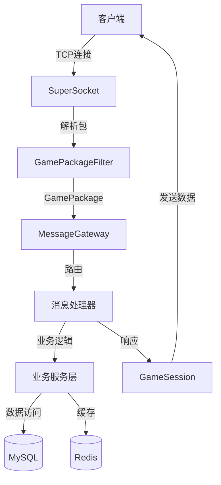
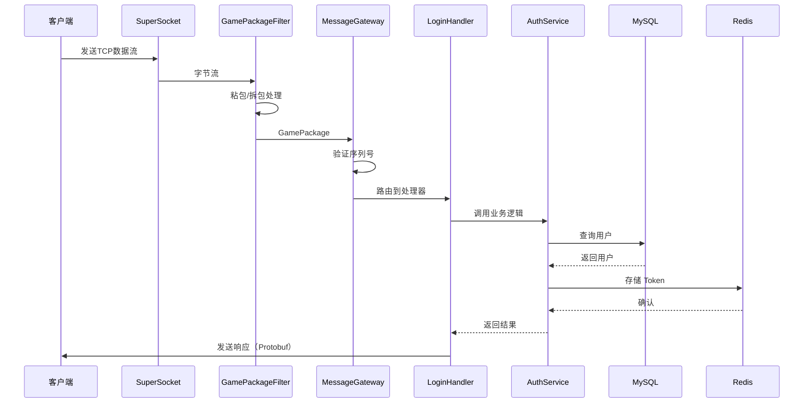

# 游戏服务器框架设计与学习指南

## 目录

- [1. 整体架构概览](#1-整体架构概览)
- [2. 分层架构详解](#2-分层架构详解)
- [3. 设计模式应用](#3-设计模式应用)
- [4. 消息处理流程](#4-消息处理流程)
- [5. 核心概念解释](#5-核心概念解释)
- [6. 如何测试](#6-如何测试)
- [7. 扩展开发指南](#7-扩展开发指南)

---

## 1. 整体架构概览

### 1.1 架构示意图



### 1.2 技术栈

| 层级 | 技术 | 作用 |
|------|------|------|
| **网络层** | SuperSocket 2.0.2 | TCP 服务器框架 |
| **协议层** | Protobuf 3.27 | 二进制序列化 |
| **数据持久化** | EF Core + MySQL | ORM + 关系数据库 |
| **缓存层** | Redis | 内存数据库 |
| **日志** | Serilog | 结构化日志 |
| **监控** | Prometheus | 指标采集 |
| **认证** | JWT + BCrypt | 令牌 + 密码加密 |

---

## 2. 分层架构详解

### 2.1 网络层（Network）

**职责**：处理 TCP 连接、粘包/拆包、会话管理

#### 核心类

##### `GamePackage`
游戏协议包定义，包含消息头和消息体。

```
包结构：
+----------+--------+----------+---------+
| Length:4 | MsgId:2| Seq:4   | Payload |
+----------+--------+----------+---------+
```

- **Length**: 总长度（包含头部）
- **MsgId**: 消息 ID
- **Sequence**: 序列号（防重放攻击）
- **Payload**: Protobuf 序列化的消息体

##### `GamePackageFilter`
继承自 `FixedHeaderPipelineFilter`，负责处理**粘包/拆包**问题。

**什么是粘包/拆包？**
- **粘包**：多个小包粘在一起到达
- **拆包**：一个大包分多次到达

**解决方案**：
1. 读取固定头部（10字节）
2. 从头部获取总长度
3. 等待读取完整包体
4. 解析为 `GamePackage`

##### `GameSessionData` + 扩展方法
存储会话的业务数据（用户ID、角色ID、认证状态等）。

```csharp
// 获取业务数据
var gameData = session.GetGameData();

// 发送消息（扩展方法）
await session.SendMessageAsync(MsgId.Login, response);
```

##### `MessageGateway`
**核心路由器**，负责：
1. 注册消息处理器（MsgId → Handler）
2. 验证序列号（防重放）
3. 分发消息到对应处理器
4. 异常处理和监控

---

### 2.2 协议层（Protos）

使用 **Protobuf** 定义所有通信消息。

#### 为什么用 Protobuf？

| 对比项 | JSON | Protobuf |
|--------|------|----------|
| 大小 | 大 | 小（约1/3-1/5） |
| 速度 | 慢 | 快 |
| 可读性 | 好 | 差（二进制） |
| 类型安全 | 弱 | 强 |

#### 文件组织

```
Protos/
├── common.proto    # 通用消息（登录、注册、心跳）
├── world.proto     # 世界/场景消息
└── room.proto      # 房间/战斗消息
```

#### 消息 ID 映射

`MsgId.cs` 定义了所有消息的唯一 ID：

```csharp
public static class MsgId
{
    public const ushort Heartbeat = 0x0001;
    public const ushort Login     = 0x1001;
    public const ushort Register  = 0x1002;
    // ...
}
```

---

### 2.3 业务层（Business）

**职责**：实现核心游戏逻辑

#### `AuthService`
认证服务，处理登录/注册逻辑：

```csharp
// 注册
await authService.RegisterAsync(username, password, email);

// 登录
var (success, message, token, user) = await authService.LoginAsync(username, password);
```

**关键技术**：
- **BCrypt**：密码哈希（不可逆）
- **JWT**：无状态令牌认证

#### `JwtService`
JWT 令牌管理：

```csharp
// 生成令牌
string token = jwtService.GenerateToken(userId, username);

// 验证令牌
var (valid, userId, username) = jwtService.ValidateToken(token);
```

#### `PlayerManager`
在线玩家管理器：

- 维护在线玩家字典（PlayerId → PlayerState）
- 会话映射（SessionId → PlayerId）
- 玩家上线/下线
- 广播消息

---

### 2.4 处理器层（Handlers）

**职责**：处理具体的消息请求

#### 消息处理器基类

```csharp
// 基础处理器（自动反序列化 Protobuf）
public abstract class MessageHandler<TRequest> : IMessageHandler
{
    protected abstract Task HandleAsync(IAppSession session, TRequest request);
}

// 需要认证的处理器
public abstract class AuthenticatedMessageHandler<TRequest> : MessageHandler<TRequest>
{
    protected abstract Task HandleAuthenticatedAsync(IAppSession session, TRequest request);
}
```

#### 示例：LoginHandler

```csharp
public class LoginHandler : MessageHandler<C2S_Login>
{
    protected override async Task HandleAsync(IAppSession session, C2S_Login request)
    {
        // 1. 调用 AuthService 验证
        var (success, message, token, user) = await _authService.LoginAsync(...);
        
        // 2. 查询角色
        var player = await _db.Players.FirstOrDefaultAsync(...);
        
        // 3. 设置会话状态
        var gameData = session.GetGameData();
        gameData.IsAuthenticated = true;
        gameData.UserId = user.Id;
        
        // 4. 添加到在线玩家
        _playerManager.AddPlayer(new PlayerState { ... });
        
        // 5. 发送响应
        await session.SendMessageAsync(MsgId.Login, response);
    }
}
```

---

### 2.5 数据层（Data）

**职责**：数据持久化和缓存

#### `GameDbContext`（EF Core）

```csharp
public class GameDbContext : DbContext
{
    public DbSet<User> Users { get; set; }
    public DbSet<Player> Players { get; set; }
    public DbSet<PlayerItem> PlayerItems { get; set; }
    // ...
}
```

**使用示例**：

```csharp
// 查询
var user = await _db.Users.FirstOrDefaultAsync(u => u.Username == username);

// 插入
_db.Players.Add(new Player { ... });
await _db.SaveChangesAsync();

// 更新
player.Level = 10;
await _db.SaveChangesAsync();
```

#### `RedisService`

封装 Redis 操作：

```csharp
// 设置键值
await redis.SetAsync("player:1001", playerData, TimeSpan.FromHours(1));

// 获取键值
var data = await redis.GetAsync<PlayerData>("player:1001");

// 发布/订阅
await redis.PublishAsync("chat:world", message);
```

---

## 3. 设计模式应用

### 3.1 分层架构模式（Layered Architecture）

```
表现层（Handlers）
    ↓
业务层（Services）
    ↓
数据层（DbContext + Redis）
```

**好处**：
- 职责清晰
- 易于测试
- 易于维护

---

### 3.2 依赖注入（Dependency Injection）

**所有服务通过 DI 容器管理**：

```csharp
services.AddSingleton<JwtService>();          // 单例
services.AddScoped<AuthService>();            // 每次请求创建
services.AddDbContext<GameDbContext>(...);    // EF Core
```

**好处**：
- 解耦依赖
- 易于单元测试（Mock）
- 统一生命周期管理

---

### 3.3 策略模式（Strategy Pattern）

**消息处理器**就是策略模式：

```csharp
// 不同的消息 ID，使用不同的处理策略
_gateway.RegisterHandler(MsgId.Login, new LoginHandler(...));
_gateway.RegisterHandler(MsgId.Register, new RegisterHandler(...));
```

**好处**：
- 易于扩展新消息
- 符合开闭原则（对扩展开放，对修改关闭）

---

### 3.4 模板方法模式（Template Method）

`MessageHandler<TRequest>` 使用模板方法：

```csharp
public async Task HandleAsync(IAppSession session, ReadOnlyMemory<byte> payload)
{
    // 1. 反序列化 Protobuf（模板固定流程）
    var request = Parser.ParseFrom(payload.Span);
    
    // 2. 调用子类实现（子类自定义）
    await HandleAsync(session, request);
}
```

---

### 3.5 工厂模式（Factory Pattern）

**DI 容器本身就是工厂**：

```csharp
var handler = scope.ServiceProvider.GetRequiredService<LoginHandler>();
```

---

### 3.6 观察者模式（Observer Pattern）

**会话事件**：

```csharp
hostBuilder.UseSessionHandler(
    onConnected: session => { ... },   // 连接事件
    onClosed: (session, reason) => { ... }  // 断开事件
);
```

---

## 4. 消息处理流程

### 4.1 完整流程图



### 4.2 详细步骤

#### 步骤 1：客户端连接

```csharp
// SuperSocket 自动接受连接
onConnected: session => {
    Metrics.ActiveConnections.Inc();
    Log.Information("客户端连接: {SessionId}", session.SessionID);
}
```

#### 步骤 2：接收数据流

SuperSocket 持续读取 TCP 数据流。

#### 步骤 3：粘包/拆包

`GamePackageFilter` 处理：

```csharp
protected override int GetBodyLengthFromHeader(ref ReadOnlySequence<byte> buffer)
{
    // 读取前4字节（总长度）
    reader.TryReadLittleEndian(out int totalLength);
    return totalLength - GamePackage.HeaderSize;
}
```

#### 步骤 4：路由消息

`MessageGateway.RouteMessageAsync`：

```csharp
// 1. 验证序列号
if (!gameData.ValidateSequence(package.Sequence)) return;

// 2. 查找处理器
if (!_handlers.TryGetValue(package.MsgId, out var handler)) return;

// 3. 执行处理器
await handler.HandleAsync(session, package.Payload);
```

#### 步骤 5：业务处理

`LoginHandler` 示例：

```csharp
// 1. 验证用户名密码（BCrypt）
var user = await _db.Users.FirstOrDefaultAsync(...);
bool valid = BCrypt.Net.BCrypt.Verify(password, user.PasswordHash);

// 2. 生成 JWT Token
string token = _jwtService.GenerateToken(user.Id, user.Username);

// 3. 查询角色
var player = await _db.Players.FirstOrDefaultAsync(...);

// 4. 设置会话状态
gameData.IsAuthenticated = true;
gameData.UserId = user.Id;

// 5. 添加到在线玩家
_playerManager.AddPlayer(new PlayerState { ... });
```

#### 步骤 6：发送响应

```csharp
await session.SendMessageAsync(MsgId.Login, new S2C_Login
{
    Code = (int)ErrorCode.Success,
    Token = token,
    Player = playerInfo
});
```

内部实现：

```csharp
// 1. 序列化 Protobuf
byte[] payload = message.ToByteArray();

// 2. 构建包头
byte[] buffer = new byte[HeaderSize + payload.Length];
BitConverter.TryWriteBytes(buffer.AsSpan(0, 4), totalLength);  // Length
BitConverter.TryWriteBytes(buffer.AsSpan(4, 2), msgId);        // MsgId
BitConverter.TryWriteBytes(buffer.AsSpan(6, 4), 0u);           // Sequence

// 3. 发送
await session.SendAsync(new ReadOnlyMemory<byte>(buffer));
```

---

## 5. 核心概念解释

### 5.1 什么是粘包/拆包？

**问题场景**：

```
发送：[包A:100字节] [包B:200字节]
```

可能收到：

```
粘包：[包A+包B:300字节]           ← 两个包粘在一起
拆包：[包A前50字节] [包A后50字节]  ← 一个包被拆开
```

**解决方案**：

使用固定头部长度字段：

```
+------------+--------+
| Length: 4  | Payload |
+------------+--------+
```

1. 先读取 4 字节的长度字段
2. 根据长度读取对应字节数
3. 保证读取完整包

---

### 5.2 什么是序列号（Sequence）？

**防止重放攻击**：

```
攻击者：截获 "转账100元" 的包
攻击者：重复发送10次 → 转账1000元！
```

**防御方案**：

每个包带序列号，服务器记录最后一个序列号：

```csharp
public bool ValidateSequence(uint sequence)
{
    if (sequence <= LastSequence)
        return false;  // 重放攻击！
    LastSequence = sequence;
    return true;
}
```

---

### 5.3 什么是 JWT？

**JWT（JSON Web Token）** 是无状态认证方案。

**传统 Session 方式**：

```
客户端 → 服务器：用户名+密码
服务器：在内存存储 SessionId → UserId
服务器 → 客户端：返回 SessionId

后续请求：
客户端 → 服务器：带 SessionId
服务器：查内存获取 UserId
```

**问题**：
- 服务器需要存储所有 Session（占内存）
- 分布式部署困难（Session 共享）

**JWT 方式**：

```
客户端 → 服务器：用户名+密码
服务器：生成 Token（包含 UserId，加密签名）
服务器 → 客户端：返回 Token

后续请求：
客户端 → 服务器：带 Token
服务器：验证签名，解析出 UserId
```

**优点**：
- 无状态（服务器不存储）
- 易于扩展（多台服务器共用密钥）

**JWT 结构**：

```
Header.Payload.Signature
```

```json
// Header
{
  "alg": "HS256",
  "typ": "JWT"
}

// Payload
{
  "userId": 1001,
  "username": "player1",
  "exp": 1733647200
}

// Signature = HMAC-SHA256(Header + Payload, SecretKey)
```

---

### 5.4 什么是 BCrypt？

**BCrypt** 是密码哈希算法（单向加密）。

**为什么不能直接存储明文密码？**

```
数据库泄露 → 所有用户密码暴露 → 撞库攻击
```

**为什么不能用 MD5/SHA256？**

```
彩虹表攻击：预计算常见密码的 MD5 值
123456 → e10adc3949ba59abbe56e057f20f883e
```

**BCrypt 的优势**：

1. **自动加盐**：每次哈希结果不同
2. **慢速算法**：暴力破解成本高
3. **可调节成本**：随硬件升级调整难度

```csharp
// 注册时
string hash = BCrypt.Net.BCrypt.HashPassword(password);
// 存储 hash 到数据库

// 登录时
bool valid = BCrypt.Net.BCrypt.Verify(password, hash);
```

---

## 6. 如何测试

### 6.1 单元测试

#### 测试业务逻辑（AuthService）

```csharp
[Fact]
public async Task RegisterAsync_ShouldCreateUser()
{
    // Arrange
    var dbContext = CreateInMemoryDbContext();
    var authService = new AuthService(dbContext, logger, jwtService);
    
    // Act
    var (success, message) = await authService.RegisterAsync(
        "testuser", "password123", "test@example.com");
    
    // Assert
    Assert.True(success);
    var user = await dbContext.Users.FirstOrDefaultAsync(u => u.Username == "testuser");
    Assert.NotNull(user);
}
```

#### 测试消息处理器（LoginHandler）

```csharp
[Fact]
public async Task LoginHandler_ShouldAuthenticateUser()
{
    // Arrange
    var mockSession = new Mock<IAppSession>();
    var handler = new LoginHandler(logger, authService, db, playerManager);
    var request = new C2S_Login { Username = "user1", Password = "pass123" };
    
    // Act
    await handler.HandleAsync(mockSession.Object, request);
    
    // Assert
    mockSession.Verify(s => s.SendAsync(It.IsAny<ReadOnlyMemory<byte>>()), Times.Once);
}
```

---

### 6.2 集成测试

#### 测试完整登录流程

```csharp
[Fact]
public async Task Integration_LoginFlow()
{
    // 1. 启动测试服务器
    var host = CreateTestHost();
    await host.StartAsync();
    
    // 2. 连接客户端
    var client = new TcpClient();
    await client.ConnectAsync("127.0.0.1", 33333);
    
    // 3. 发送登录请求
    var request = new C2S_Login { Username = "test", Password = "123456" };
    await SendPackageAsync(client, MsgId.Login, request);
    
    // 4. 接收响应
    var response = await ReceivePackageAsync<S2C_Login>(client);
    
    // 5. 验证
    Assert.Equal((int)ErrorCode.Success, response.Code);
    Assert.NotEmpty(response.Token);
}
```

---

### 6.3 压力测试

使用工具模拟大量并发连接：

```bash
# 使用 k6 进行压力测试
k6 run --vus 1000 --duration 30s load_test.js
```

**监控指标**：
- 活跃连接数：`Metrics.ActiveConnections`
- 消息处理速度：`Metrics.MessageCount`
- 错误率：`Metrics.MessageErrors`

---

### 6.4 手动测试工具

#### 使用 Telnet 测试（仅限文本协议）

```bash
telnet localhost 33333
```

#### 使用自定义客户端

创建简单的控制台客户端：

```csharp
class Program
{
    static async Task Main()
    {
        var client = new TcpClient();
        await client.ConnectAsync("127.0.0.1", 33333);
        var stream = client.GetStream();
        
        // 发送登录请求
        var request = new C2S_Login { Username = "test", Password = "123456" };
        await SendAsync(stream, MsgId.Login, request);
        
        // 接收响应
        var response = await ReceiveAsync<S2C_Login>(stream);
        Console.WriteLine($"登录结果: {response.Message}");
    }
}
```

---

## 7. 扩展开发指南

### 7.1 如何添加新的消息？

#### 步骤 1：定义 Protobuf 消息

编辑 `Protos/common.proto`：

```protobuf
// 请求
message C2S_GetPlayerInfo {
  int64 player_id = 1;
}

// 响应
message S2C_GetPlayerInfo {
  int32 code = 1;
  string message = 2;
  PlayerInfo player = 3;
}
```

#### 步骤 2：添加消息 ID

编辑 `Network/MsgId.cs`：

```csharp
public const ushort GetPlayerInfo = 0x1010;
```

#### 步骤 3：创建处理器

创建 `Handlers/PlayerHandlers.cs`：

```csharp
public class GetPlayerInfoHandler : AuthenticatedMessageHandler<C2S_GetPlayerInfo>
{
    private readonly GameDbContext _db;
    
    public GetPlayerInfoHandler(GameDbContext db)
    {
        _db = db;
    }
    
    protected override async Task HandleAuthenticatedAsync(
        IAppSession session, C2S_GetPlayerInfo request)
    {
        var player = await _db.Players.FindAsync(request.PlayerId);
        
        await session.SendMessageAsync(MsgId.GetPlayerInfo, new S2C_GetPlayerInfo
        {
            Code = player != null ? (int)ErrorCode.Success : (int)ErrorCode.NotFound,
            Player = player?.ToProto()
        });
    }
}
```

#### 步骤 4：注册处理器

编辑 `Program.cs`：

```csharp
// ConfigureServices
services.AddScoped<GetPlayerInfoHandler>();

// MessageHandlerRegistration.StartAsync
_gateway.RegisterHandler(MsgId.GetPlayerInfo, 
    scope.ServiceProvider.GetRequiredService<GetPlayerInfoHandler>());
```

#### 步骤 5：编译测试

```bash
dotnet build
dotnet run
```

---

### 7.2 如何添加新的业务服务？

#### 创建 `ItemService.cs`

```csharp
public class ItemService
{
    private readonly GameDbContext _db;
    private readonly ILogger<ItemService> _logger;
    
    public ItemService(GameDbContext db, ILogger<ItemService> logger)
    {
        _db = db;
        _logger = logger;
    }
    
    public async Task<bool> AddItemToPlayerAsync(long playerId, int itemId, int count)
    {
        var playerItem = await _db.PlayerItems
            .FirstOrDefaultAsync(pi => pi.PlayerId == playerId && pi.ItemId == itemId);
        
        if (playerItem == null)
        {
            _db.PlayerItems.Add(new PlayerItem
            {
                PlayerId = playerId,
                ItemId = itemId,
                Count = count
            });
        }
        else
        {
            playerItem.Count += count;
        }
        
        await _db.SaveChangesAsync();
        return true;
    }
}
```

#### 注册服务

```csharp
services.AddScoped<ItemService>();
```

---

### 7.3 如何使用 Redis 缓存？

#### 缓存玩家数据

```csharp
public class PlayerService
{
    private readonly RedisService _redis;
    private readonly GameDbContext _db;
    
    public async Task<Player?> GetPlayerAsync(long playerId)
    {
        // 1. 尝试从 Redis 获取
        var cacheKey = $"player:{playerId}";
        var cached = await _redis.GetAsync<Player>(cacheKey);
        if (cached != null)
            return cached;
        
        // 2. 从数据库查询
        var player = await _db.Players.FindAsync(playerId);
        
        // 3. 写入缓存（1小时过期）
        if (player != null)
            await _redis.SetAsync(cacheKey, player, TimeSpan.FromHours(1));
        
        return player;
    }
}
```

---

### 7.4 如何添加监控指标？

#### 定义指标

编辑 `Infrastructure/Metrics.cs`：

```csharp
public static readonly Counter ItemPickupCount = Prometheus.Metrics.CreateCounter(
    "game_item_pickup_total",
    "物品拾取次数",
    new CounterConfiguration
    {
        LabelNames = new[] { "item_id" }
    });
```

#### 使用指标

```csharp
public async Task PickupItemAsync(int itemId)
{
    // 业务逻辑
    await _itemService.AddItemToPlayerAsync(playerId, itemId, 1);
    
    // 记录指标
    Metrics.ItemPickupCount.WithLabels(itemId.ToString()).Inc();
}
```

---

## 总结

### 核心要点

1. **分层架构**：网络层 → 处理器层 → 业务层 → 数据层
2. **依赖注入**：所有服务通过 DI 管理
3. **Protobuf**：高效的二进制序列化
4. **SuperSocket**：处理 TCP 连接和粘包/拆包
5. **JWT + BCrypt**：安全的认证方案

### 学习建议

1. **从流程入手**：跟踪一个登录请求的完整生命周期
2. **阅读源码**：逐个类阅读，理解职责
3. **动手实践**：添加新消息、新功能
4. **监控日志**：观察运行时行为

### 进阶主题

- 分布式部署（多台服务器）
- 热更新（不停服更新）
- 战斗同步（帧同步/状态同步）
- 数据库优化（索引、分表）
- 安全加固（DDoS 防护、反作弊）

---

**祝学习愉快！** 🚀
