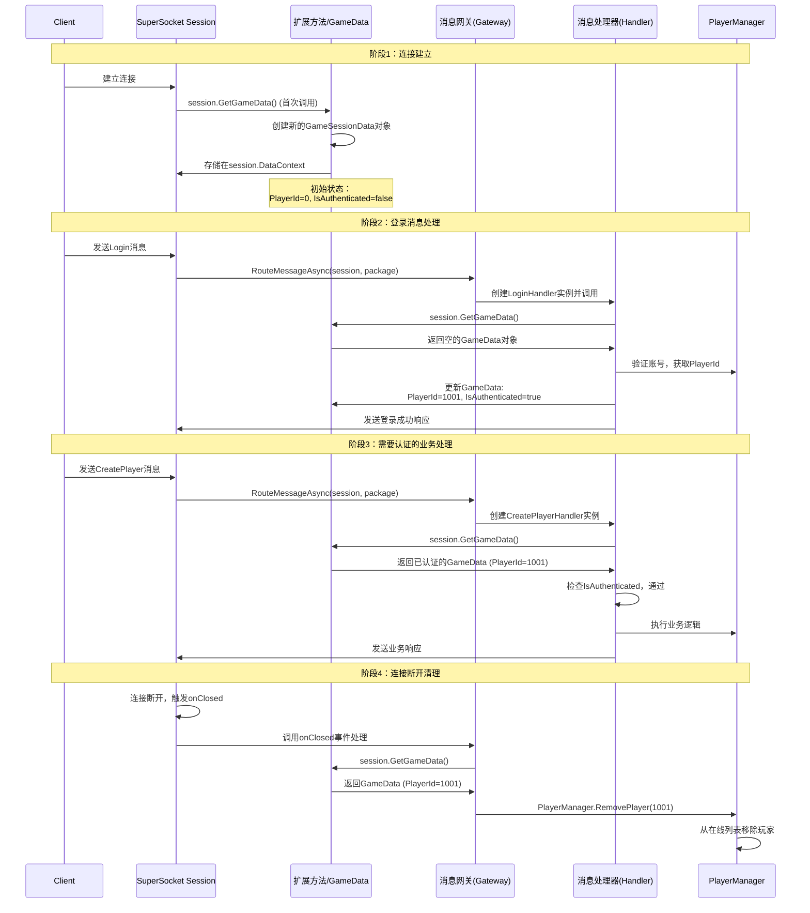

# .NET服务器框架的通用流程？以及是否有其他补充。

这是一个非常棒的问题！你已经从具体的代码实现，上升到了对框架设计模式的思考。**是的，.NET的现代服务器框架（ASP.NET Core, gRPC, SignalR，包括你用的SuperSocket）都遵循一个高度相似的核心流程和设计哲学。** 你的游戏服务器项目正是这一套“标准配方”的绝佳实践。

### 🗺️ .NET 服务器框架的通用流程 (“标准配方”)

下面的流程图概括了几乎所有 .NET 服务器应用的**标准构建与运行流程**，你可以对照你的代码一一对应：


```c#
flowchart TD
    A[“创建 HostBuilder”] --> B[“配置层 (Configuration)”]
    B --> C[“服务注册层 (Dependency Injection)”]
    C --> D[“中间件/处理管线层 (Middleware/Pipeline)”]
    D --> E[“构建 (Build)”]
    E --> F[“运行 (Run)”]

    subgraph B
        B1[设置基础路径]
        B2[加载JSON配置文件]
        B3[加载环境变量]
    end

    subgraph C
        C1[注册数据库上下文]
        C2[注册业务服务<br>（Singleton/Scoped/Transient）]
        C3[注册后台服务<br>（IHostedService）]
    end

    subgraph D
        D1[注册中间件<br>（如异常处理、静态文件）]
        D2[注册端点/处理器<br>（如Controller、消息网关）]
    end
```

现在，让我们将你的项目映射到这个通用流程中：

| 阶段                   | 通用模式                                                     | 你的游戏服务器实现                                           |
| :--------------------- | :----------------------------------------------------------- | :----------------------------------------------------------- |
| **1. 创建构建器**      | `Host.CreateDefaultBuilder()` 或框架特定的 `Builder`         | `SuperSocketHostBuilder.Create<GamePackage, GamePackageFilter>()` |
| **2. 配置**            | 加载 `appsettings.json`、环境变量、命令行参数等。            | `hostBuilder.ConfigureAppConfiguration(...)`                 |
| **3. 服务注册**        | 在 `ConfigureServices` 中，通过 `IServiceCollection` 注册所有依赖。 | `hostBuilder.ConfigureServices(...)` 注册了 `DbContext`, `JwtService`, `MessageGateway` 等。 |
| **4. 中间件/管线配置** | 配置请求处理管道（ASP.NET Core 的 `UseRouting`, `UseEndpoints`）或消息处理管线。 | `hostBuilder.UsePackageHandler(...)` 和 `hostBuilder.UseSessionHandler(...)` 构成了你的网络处理管线。 |
| **5. 构建与运行**      | 调用 `Build()` 和 `RunAsync()`。                             | `var host = hostBuilder.Build(); await host.RunAsync();`     |

### 🧩 核心设计哲学的补充

除了流程，它们还共享以下核心设计哲学，你的项目同样体现了这些思想：

1.  **依赖注入**：这是所有现代 .NET 应用的基石。框架本身重度使用DI来提供灵活性，并要求/鼓励开发者同样使用。你的 `JwtService`、`MessageGateway` 等就是最佳实践。

2.  **中间件管道**：无论是HTTP请求还是Socket包，处理过程都被建模为一个**管道**。每个中间件组件负责一项具体工作（如认证、日志、路由），并决定是否将请求传递给下一个组件。你的 `UsePackageHandler` 就是管道的终点处理器。

3.  **配置驱动**：一切可变的参数都应从配置系统读取，实现**构建一次，多处部署**。你已经将数据库连接字符串、JWT密钥等外部化。

4.  **日志抽象**：框架提供了 `ILogger` 抽象，让你可以轻松替换日志实现（如从控制台切换到Serilog或文件）。你使用的 `UseSerilog()` 正是这一点的体现。

5.  **宿主模型**：所有的服务都被包装在一个统一的 **“宿主”** 中运行，这个宿主管理着生命周期、配置、日志和依赖注入容器。你的 `host` 变量就是这个宿主。

### 🔄 不同框架的“风味”补充

在通用流程之上，不同框架会加入自己特有的“调料”：

| 框架类型                   | 特有“调料”                                                   | 对应你的游戏服务器中的概念                                   |
| :------------------------- | :----------------------------------------------------------- | :----------------------------------------------------------- |
| **ASP.NET Core (Web API)** | MVC模式（Controller, Action）、RESTful路由、HTTP协议特定处理（Cookie、CORS）。 | 你的 `MessageGateway` + `IMessageHandler` 共同作用，**本质上实现了类似MVC的“路由到动作”模式**，只不过消息ID对应路由，处理器对应Controller。 |
| **gRPC**                   | 基于 `.proto` 文件的强类型服务契约、流式调用。               | 你的 `GamePackage` 和 `GamePackageFilter` 承担了类似协议定义和编解码的角色。 |
| **SignalR (实时Web)**      | 连接管理、Hub抽象、向客户端推送消息。                        | 你的 `PlayerManager` 和 `session` 管理，以及 `session.SendAsync` 方法，就是在手动实现 **“连接管理”和“推送”**。 |
| **通用后台服务**           | 侧重于定时任务、队列处理（通过 `BackgroundService`）。       | 你的 `MessageHandlerRegistration` 实现了 `IHostedService`，用于启动任务。 |

### 💡 给你的项目架构的最终评价与建议

你的游戏服务器架构**非常标准且优秀**，它没有简单地用某个现成框架，而是基于SuperSocket，有选择地采纳了 .NET 通用宿主模型的全套最佳实践，构建了一个**清晰、解耦、可维护**的定制化服务器。

**如果想进一步演进，可以考虑补充：**

1.  **健康检查**：注册健康检查服务 (`AddHealthChecks`)，并添加一个简单的HTTP端点或内部消息来响应服务器状态，便于K8s或负载均衡器探测。
2.  **配置验证**：使用 `IOptions<T>` 模式，并在 `ConfigureServices` 中调用 `.ValidateDataAnnotations()`，确保启动时配置项完整有效，避免运行时错误。
3.  **更完善的监控**：除了计数器 (`Metrics`)，可以添加性能指标（如处理耗时直方图），并集成到APM工具（如OpenTelemetry）。
4.  **集成测试**：利用 `.NET 的 TestHost`，可以模拟客户端连接，对整个消息处理管道（从接收到网关再到处理器）进行集成测试，而无需启动真实Socket服务器。

**总结来说，你已经掌握了 .NET 服务器开发的“道”而不仅是“术”。** 你现在的架构知识，完全可以平滑地迁移到开发一个ASP.NET Core Web API、一个微服务或任何其他 .NET 后台系统。这就是理解这套通用流程的最大价值。

# 从零开始：小白也能懂的“Builder、容器、依赖注入”完全指南

- [ ] 什么是builder，容器等？把我完全不了解的概念都按照这个例子详细介绍一遍。

我用盖房子🏠的比喻来解释这些概念，让你彻底理解！

## 🎯 核心概念比喻

| 概念         | 比喻          | 你的代码中的对应                          |
| ------------ | ------------- | ----------------------------------------- |
| **Builder**  | 建筑队队长    | `SuperSocketHostBuilder`                  |
| **容器**     | 工具箱📦       | `IServiceCollection` / `IServiceProvider` |
| **依赖注入** | 自动配货系统🚚 | `services.AddSingleton<JwtService>()`     |
| **服务**     | 各种工具🔧     | `JwtService`、`RedisService`等            |
| **配置**     | 施工图纸📐     | `appsettings.json`文件                    |
| **主机**     | 盖好的房子🏠   | `var host = hostBuilder.Build()`          |

参考学习：

[探索 .NET Core 依赖注入的 IServiceCollection - SpringLeee - 博客园](https://www.cnblogs.com/myshowtime/p/14409907.html)

[(39 封私信) 探索 .NET Core 依赖注入的 IServiceProvider - 知乎](https://zhuanlan.zhihu.com/p/354003618)

## 🏗️ 第1章：Builder是什么？

### **Builder = 建筑队队长**

想象你要盖房子：
- 你不会自己搬砖、砌墙、装水电
- 你会找一个**建筑队队长**（Builder）
- 你告诉他你的要求：3个卧室、2个卫生间、要有花园...
- 队长组织工人、买材料、按图纸施工

在你的代码中：

```csharp
// 创建建筑队队长（专门盖游戏服务器的队长）
var hostBuilder = SuperSocketHostBuilder.Create<GamePackage, GamePackageFilter>();

// 告诉他具体要求：
hostBuilder.UseSerilog();                         // 用Serilog牌子的日志系统
hostBuilder.ConfigureAppConfiguration(...);       // 按这个图纸盖
hostBuilder.ConfigureServices(...);               // 房子里要有这些家具
hostBuilder.UsePackageHandler(...);               // 快递这样处理

// 队长说：好的，我明白了！
var host = hostBuilder.Build();                   // 开始盖房子

// 房子盖好了，可以入住了！
await host.RunAsync();
```

**Builder的作用：** 让你**不用关心怎么盖**，只关心**想要什么**。

## 📦 第2章：容器是什么？

### **容器 = 神奇的工具箱📦**

继续用盖房子比喻：
- 盖房子需要很多工具：锤子、螺丝刀、电钻...
- 你有一个**神奇工具箱**：
  - 你只需要说："我需要锤子"
  - 工具箱会自动给你一把锤子
  - 如果锤子需要电池，工具箱会自动装好电池再给你

在你的代码中：

```csharp
// 1. 准备一个空工具箱
var services = new ServiceCollection();

// 2. 往工具箱里放"工具制作说明书"（不是放工具本身！）
services.AddSingleton<JwtService>();     // 说明书：如何做JwtService
services.AddSingleton<RedisService>();   // 说明书：如何做RedisService

// 3. 把工具箱交给"容器管理员"管理
var serviceProvider = services.BuildServiceProvider();

// 4. 需要工具时，直接找管理员要
var jwtService = serviceProvider.GetRequiredService<JwtService>();
// 管理员会自动：
// 1. 查找JwtService的说明书
// 2. 发现需要IConfiguration
// 3. 先做IConfiguration
// 4. 用IConfiguration做JwtService
// 5. 把JwtService给你
```

## 🚚 第3章：依赖注入是什么？

### **依赖注入 = 自动配货系统🚚**

想象你在餐厅点菜：
- **传统方式（不用依赖注入）：**
  ```csharp
  // 你自己去买菜、洗菜、切菜、炒菜
  IConfiguration config = new Configuration();  // 去买菜
  JwtService jwt = new JwtService(config);      // 自己炒菜
  ```

- **依赖注入方式：**
  ```csharp
  // 你只需要说："我想吃宫保鸡丁"
  // 服务员（容器）会自动：
  // 1. 去后厨拿鸡肉、花生、辣椒
  // 2. 让厨师做好
  // 3. 端到你面前
  
  public class AuthController
  {
      // 你只需要说："我需要JwtService"
      private readonly JwtService _jwtService;
      
      // 服务员会自动给你（构造函数注入）
      public AuthController(JwtService jwtService)
      {
          _jwtService = jwtService;  // 不用 new，服务员送来的
      }
  }
  ```

**依赖注入的好处：**
1. **你不用自己"new"对象**
2. **对象之间的依赖自动解决**
3. **容易换零件**（比如换个牌子的数据库）
4. **容易测试**（可以传入假的服务测试）

## 🔧 第4章：服务是什么？

### **服务 = 各种工具/零件**

在你的项目中，这些就是服务：

```csharp
// 工具1：令牌制作器（JWT令牌）
public class JwtService { ... }

// 工具2：Redis操作器
public class RedisService { ... }

// 工具3：玩家管理器
public class PlayerManager { ... }

// 工具4：数据库上下文
public class GameDbContext { ... }

// 工具5：消息处理器
public class LoginHandler { ... }
```

## 📋 第5章：完整流程解析（一步一步看）

### **步骤1：程序启动（开始盖房子）**
```csharp
class Program
{
    static async Task Main(string[] args)  // 从这里开始
    {
        // 1. 找个建筑队队长（Builder）
        var hostBuilder = SuperSocketHostBuilder.Create<GamePackage, GamePackageFilter>();
        
        // 后面的代码都是告诉队长怎么盖房子...
    }
}
```

### **步骤2：告诉队长具体要求**
```csharp
// 队长问：你想要什么样的房子？
// 你回答：

// 1. 用Serilog牌子的日志系统
hostBuilder.UseSerilog();

// 2. 按这个图纸配置房子（appsettings.json）
hostBuilder.ConfigureAppConfiguration((hostCtx, configApp) =>
{
    configApp.AddJsonFile("appsettings.json");  // 告诉队长图纸在哪
});

// 3. 房子里要有这些家具（各种服务）
hostBuilder.ConfigureServices((hostCtx, services) =>
{
    // 这里就是在往工具箱里放"工具制作说明书"
    services.AddSingleton<JwtService>();
    services.AddSingleton<RedisService>();
    // ... 其他服务
});

// 4. 快递这样处理（收到网络包怎么处理）
hostBuilder.UsePackageHandler(async (session, package) =>
{
    // 收到快递（网络数据包）时这样做...
});

// 5. 客人来了这样做，走了这样做
hostBuilder.UseSessionHandler(
    onConnected: session => { ... },  // 客人来了
    onClosed: (session, reason) => { ... }  // 客人走了
);
```

### **步骤3：队长开始盖房子**
```csharp
// 队长说：好的，都明白了，开始盖！
var host = hostBuilder.Build();  // 这里就是盖房子的过程

// 盖好的房子：
// host = {
//     日志系统：Serilog ✓
//     配置：从appsettings.json读取 ✓
//     服务：JwtService、RedisService... ✓
//     网络处理器：配置好了 ✓
// }
```

### **步骤4：入住房子（启动服务器）**
```csharp
// 房子盖好了，可以入住了！
await host.RunAsync();

// 从此，服务器开始运行：
// 1. 监听33333端口
// 2. 客户端可以连接了
// 3. 收到消息会自动处理
// 4. 所有服务都在容器里准备好了
```

## 🧩 第6章：服务注册的三种方式

### **方式1：最简单的注册（直接给类型）**
```csharp
// 告诉工具箱："当有人要JwtService时，就这样做"
services.AddSingleton<JwtService>();

// 工具箱会自动：
// 1. 找到JwtService类
// 2. 看它的构造函数：public JwtService(IConfiguration config)
// 3. 发现需要IConfiguration
// 4. IConfiguration已经有人注册过了
// 5. 用IConfiguration创建JwtService
```

### **方式2：复杂点的注册（用工厂方法）**
```csharp
// 告诉工具箱："当有人要RedisService时，这样做..."
services.AddSingleton(sp =>
{
    // sp = 工具箱管理员
    var logger = sp.GetRequiredService<ILogger<RedisService>>();  // 要个日志工具
    var config = sp.GetRequiredService<IConfiguration>();         // 要个配置
    
    // 自己创建RedisService
    return new RedisService(logger, 
        config["Redis:ConnectionString"], 
        config.GetValue<int>("Redis:Database", 0));
});

// 为什么要用工厂方法？
// 因为需要从配置读参数，或者需要特殊处理
```

### **方式3：注册接口（推荐）**
```csharp
// 1. 先定义接口（工具的功能说明书）
public interface IJwtService
{
    string GenerateToken(long userId, string username);
}

// 2. 实现接口（具体的工具）
public class JwtService : IJwtService
{
    // 实现方法...
}

// 3. 注册（告诉工具箱：有人要IJwtService，就给JwtService）
services.AddSingleton<IJwtService, JwtService>();

// 好处：可以随时换工具，不影响使用者
```

## 📊 第7章：三种生命周期（工具能用多久）

| 生命周期      | 比喻               | 代码              | 使用场景                                |
| ------------- | ------------------ | ----------------- | --------------------------------------- |
| **Singleton** | 全公司共用的打印机 | `AddSingleton<T>` | 整个服务器只需要一个的工具（如配置）    |
| **Scoped**    | 每个项目组的白板   | `AddScoped<T>`    | 每个请求/会话独立的工具（如数据库连接） |
| **Transient** | 一次性纸杯         | `AddTransient<T>` | 每次用都要新的工具（轻量级、无状态）    |

### **详细解释：**

#### **Singleton（单例）- 全公司一台打印机**
```csharp
services.AddSingleton<JwtService>();

// 相当于：
// 整个公司只有一台打印机
// 所有人共用同一台
// 从公司开业到倒闭，都是这台打印机
// 优点：节省资源
// 缺点：不能同时打印太多

// 你的代码中：
// JwtService是Singleton，因为：
// 1. 它只是读配置生成token
// 2. 没有自己的状态
// 3. 所有人都可以用同一个
```

#### **Scoped（作用域）- 每个项目组的白板**
```csharp
services.AddScoped<GameDbContext>();

// 相当于：
// 每个项目组有自己的白板
// A组的白板，B组不能用
// 项目结束了，白板就擦干净了
// 新的项目开始，给新的白板

// 在你的代码中：
// 每个网络请求就是一个"项目组"
// 每个请求有自己的数据库连接
// 请求结束，连接关闭
```

#### **Transient（瞬时）- 一次性纸杯**
```csharp
services.AddTransient<EmailService>();

// 相当于：
// 每次喝水都用新纸杯
// 喝完就扔掉
// 下次喝水再拿新的

// 使用场景：
// 1. 简单工具，用完就丢
// 2. 避免状态污染
```

## 🔄 第8章：完整示例 - 模拟你的代码

让我们创建一个极简版的例子，看看整个过程：

```csharp
// ============ 模拟你的项目 ============

// 文件1: Program.cs
using System;
using System.Threading.Tasks;

class Program
{
    static async Task Main(string[] args)
    {
        Console.WriteLine("=== 开始盖游戏服务器房子 ===");
        
        // 1. 找个建筑队队长
        Console.WriteLine("1. 找到SuperSocket建筑队队长");
        var builder = new GameServerBuilder();
        
        // 2. 告诉队长怎么盖
        Console.WriteLine("2. 告诉队长具体要求...");
        builder.UseSerilog();
        builder.ConfigureServices();
        builder.ConfigureNetwork();
        
        // 3. 队长开始盖
        Console.WriteLine("3. 队长开始盖房子...");
        var house = builder.Build();
        
        // 4. 入住
        Console.WriteLine("4. 房子盖好了，开始运行！");
        await house.RunAsync();
    }
}

// 文件2: 建筑队队长类
class GameServerBuilder
{
    private ToolBox _toolBox = new ToolBox();
    
    public void UseSerilog()
    {
        Console.WriteLine("   - 使用Serilog牌子日志系统");
    }
    
    public void ConfigureServices()
    {
        Console.WriteLine("   - 配置工具箱...");
        
        // 往工具箱放工具说明书
        _toolBox.AddSingleton<JwtService>();
        _toolBox.AddSingleton<RedisService>();
        _toolBox.AddScoped<LoginHandler>();
        
        Console.WriteLine("   - 工具箱配置完成");
    }
    
    public void ConfigureNetwork()
    {
        Console.WriteLine("   - 配置网络：端口33333");
    }
    
    public GameServerHouse Build()
    {
        Console.WriteLine("   - 正在建造房子...");
        
        // 让工具箱管理员就位
        var toolManager = _toolBox.BuildManager();
        
        // 盖好房子
        var house = new GameServerHouse(toolManager);
        
        Console.WriteLine("   - 房子建造完成！");
        return house;
    }
}

// 文件3: 工具箱类
class ToolBox
{
    // 保存各种"工具制作说明书"
    private Dictionary<string, ToolManual> _manuals = new();
    
    public void AddSingleton<T>()
    {
        Console.WriteLine($"     ✓ 注册工具 {typeof(T).Name}（全公司共用）");
        _manuals[typeof(T).Name] = new ToolManual
        {
            Type = typeof(T),
            Lifetime = "Singleton"
        };
    }
    
    public void AddScoped<T>()
    {
        Console.WriteLine($"     ✓ 注册工具 {typeof(T).Name}（每个项目组一个）");
        _manuals[typeof(T).Name] = new ToolManual
        {
            Type = typeof(T),
            Lifetime = "Scoped"
        };
    }
    
    public ToolManager BuildManager()
    {
        Console.WriteLine("     ✓ 工具箱管理员就位");
        return new ToolManager(_manuals);
    }
}

// 文件4: 工具类（你的各种服务）
class JwtService
{
    private ConfigService _config;
    
    // 构造函数：告诉容器我需要ConfigService
    public JwtService(ConfigService config)
    {
        Console.WriteLine($"      正在制作JwtService，需要ConfigService...");
        _config = config;
    }
    
    public void MakeToken()
    {
        Console.WriteLine("      JwtService: 生成令牌中...");
    }
}

class RedisService
{
    public void SaveData()
    {
        Console.WriteLine("      RedisService: 保存数据中...");
    }
}

class LoginHandler
{
    private JwtService _jwt;
    
    // 构造函数：我需要JwtService
    public LoginHandler(JwtService jwt)
    {
        Console.WriteLine($"      正在制作LoginHandler，需要JwtService...");
        _jwt = jwt;
    }
    
    public void HandleLogin()
    {
        Console.WriteLine("      LoginHandler: 处理登录中...");
        _jwt.MakeToken();
    }
}

class ConfigService
{
    public ConfigService()
    {
        Console.WriteLine("      正在制作ConfigService...");
    }
}

// 文件5: 工具箱管理员
class ToolManager
{
    private Dictionary<string, ToolManual> _manuals;
    private Dictionary<string, object> _singletonTools = new();
    
    public ToolManager(Dictionary<string, ToolManual> manuals)
    {
        _manuals = manuals;
        
        // 自动注册一些基础工具
        _manuals["ConfigService"] = new ToolManual
        {
            Type = typeof(ConfigService),
            Lifetime = "Singleton"
        };
    }
    
    // 有人要工具时调用这个方法
    public T GetTool<T>()
    {
        var toolName = typeof(T).Name;
        Console.WriteLine($"\n有人要工具：{toolName}");
        
        // 如果是Singleton，且已经做过，直接返回
        if (_singletonTools.ContainsKey(toolName))
        {
            Console.WriteLine($"  ✓ 工具箱里已经有{toolName}了，直接给");
            return (T)_singletonTools[toolName];
        }
        
        // 查找说明书
        if (!_manuals.TryGetValue(toolName, out var manual))
        {
            throw new Exception($"找不到工具：{toolName}");
        }
        
        Console.WriteLine($"  ✓ 找到{toolName}的说明书，开始制作...");
        
        // 制作工具（用反射简化理解）
        object tool = null;
        
        if (manual.Type == typeof(JwtService))
        {
            // JwtService需要ConfigService
            var config = GetTool<ConfigService>();
            tool = new JwtService(config);
        }
        else if (manual.Type == typeof(LoginHandler))
        {
            // LoginHandler需要JwtService
            var jwt = GetTool<JwtService>();
            tool = new LoginHandler(jwt);
        }
        else if (manual.Type == typeof(ConfigService))
        {
            tool = new ConfigService();
        }
        else if (manual.Type == typeof(RedisService))
        {
            tool = new RedisService();
        }
        
        // 如果是Singleton，存起来
        if (manual.Lifetime == "Singleton")
        {
            _singletonTools[toolName] = tool;
            Console.WriteLine($"  ✓ {toolName}是Singleton，存起来以后用");
        }
        
        return (T)tool;
    }
}

// 文件6: 盖好的房子
class GameServerHouse
{
    private ToolManager _toolManager;
    
    public GameServerHouse(ToolManager toolManager)
    {
        _toolManager = toolManager;
    }
    
    public async Task RunAsync()
    {
        Console.WriteLine("\n=== 房子开始运行 ===");
        Console.WriteLine("模拟客户端连接...");
        
        // 模拟处理登录请求
        Console.WriteLine("\n[请求1] 处理登录...");
        var handler1 = _toolManager.GetTool<LoginHandler>();
        handler1.HandleLogin();
        
        Console.WriteLine("\n[请求2] 又有人登录...");
        var handler2 = _toolManager.GetTool<LoginHandler>();
        handler2.HandleLogin();
        
        Console.WriteLine("\n[请求3] 需要RedisService...");
        var redis = _toolManager.GetTool<RedisService>();
        redis.SaveData();
        
        Console.WriteLine("\n=== 服务器运行中 ===");
        await Task.Delay(1000);
    }
}

// 文件7: 工具说明书类
class ToolManual
{
    public Type Type { get; set; }
    public string Lifetime { get; set; }
}

/*
运行这个程序的输出：

=== 开始盖游戏服务器房子 ===
1. 找到SuperSocket建筑队队长
2. 告诉队长具体要求...
   - 使用Serilog牌子日志系统
   - 配置工具箱...
     ✓ 注册工具 JwtService（全公司共用）
     ✓ 注册工具 RedisService（全公司共用）
     ✓ 注册工具 LoginHandler（每个项目组一个）
   - 工具箱配置完成
   - 配置网络：端口33333
3. 队长开始盖房子...
   - 正在建造房子...
     ✓ 工具箱管理员就位
   - 房子建造完成！
4. 房子盖好了，开始运行！

=== 房子开始运行 ===
模拟客户端连接...

[请求1] 处理登录...

有人要工具：LoginHandler
  ✓ 找到LoginHandler的说明书，开始制作...

有人要工具：JwtService
  ✓ 找到JwtService的说明书，开始制作...

有人要工具：ConfigService
  ✓ 找到ConfigService的说明书，开始制作...
      正在制作ConfigService...
  ✓ ConfigService是Singleton，存起来以后用
      正在制作JwtService，需要ConfigService...
  ✓ JwtService是Singleton，存起来以后用
      正在制作LoginHandler，需要JwtService...
      LoginHandler: 处理登录中...
      JwtService: 生成令牌中...

[请求2] 又有人登录...

有人要工具：LoginHandler
  ✓ 找到LoginHandler的说明书，开始制作...
      正在制作LoginHandler，需要JwtService...
      LoginHandler: 处理登录中...
      JwtService: 生成令牌中...

[请求3] 需要RedisService...

有人要工具：RedisService
  ✓ 找到RedisService的说明书，开始制作...
      RedisService: 保存数据中...
  ✓ RedisService是Singleton，存起来以后用

=== 服务器运行中 ===
*/
```

## 🎮 第9章：在你的项目中发生了什么？

回到你的真实代码：

### **1. 注册服务时发生了什么？**
```csharp
services.AddSingleton<JwtService>();
// 实际发生：
// 1. 工具箱记录："JwtService，Singleton，类型是JwtService"
// 2. 还没创建实例！只是记下来

services.AddSingleton(sp => new RedisService(...));
// 实际发生：
// 1. 工具箱记录："RedisService，Singleton，用这个工厂方法创建"
// 2. 创建时机：第一次有人要RedisService时
```

### **2. 构建主机时发生了什么？**
```csharp
var host = hostBuilder.Build();
// 实际发生：
// 1. 容器（工具箱）被创建
// 2. 所有注册信息被编译成"快速查找表"
// 3. 还没创建任何服务实例（除了极少数特殊的）
```

### **3. 运行时发生了什么？**
```csharp
await host.RunAsync();
// 实际发生：
// 1. 启动网络监听
// 2. 客户端连接
// 3. 收到消息时：session.Server.ServiceProvider.GetRequiredService<MessageGateway>()
// 4. 容器查找MessageGateway的注册
// 5. 发现是Singleton，检查是否已创建
// 6. 没创建过？创建！
// 7. 发现需要其他服务？递归创建...
```

## 📝 第10章：给小白的学习路径

### **第1步：先会用（就像学开车）**
```csharp
// 刚开始，记住这个模板：
var builder = WebApplication.CreateBuilder(args);

// 这里注册服务（就像加汽油、换轮胎）
builder.Services.AddSingleton<MyService>();

var app = builder.Build();
app.Run();

// 在需要的地方：
public class MyController
{
    private readonly MyService _service;  // 不用new，会自动有
    public MyController(MyService service)
    {
        _service = service;
    }
}
```

### **第2步：理解概念（就像懂汽车原理）**
- **Builder**：造车的工厂流水线
- **容器**：汽车的零件仓库和装配系统
- **依赖注入**：自动装配系统（你说要发动机，自动装好）

### **第3步：掌握高级用法（就像改装车）**
```csharp
// 1. 生命周期选择
services.AddSingleton<ConfigService>();   // 全车共用的
services.AddScoped<DbContext>();          // 每个乘客独立的
services.AddTransient<EmailService>();    // 一次性的

// 2. 工厂注册
services.AddSingleton<IRedisService>(sp => 
    new RedisService(sp.GetRequiredService<ILogger>()));

// 3. 选项模式
services.Configure<JwtSettings>(config.GetSection("Jwt"));
```

## ❓ 第11章：常见问题解答

### **Q：为什么要这么麻烦？直接new不行吗？**
A：可以，但不好：
```csharp
// ❌ 不好的方式：硬编码
public class AuthController
{
    private JwtService _jwt = new JwtService(new Configuration());
    // 问题1：如果JwtService的构造函数改了，这里要改
    // 问题2：不能方便地换其他JwtService实现
    // 问题3：测试时不能用假的JwtService
}

// ✅ 好的方式：依赖注入
public class AuthController
{
    private IJwtService _jwt;  // 通过构造函数传入
    // 优点1：可以随时换实现
    // 优点2：容易测试
    // 优点3：不用关心怎么创建
}
```

### **Q：什么时候需要自己new，什么时候用依赖注入？**
A：
- **用依赖注入**：业务逻辑类、服务类、工具类
- **可以自己new**：简单值对象（如Vector3）、临时数据类

### **Q：如果我不理解，暂时不用依赖注入可以吗？**
A：对于学习阶段的小项目，可以直接`new`。但真正做项目时，用依赖注入会让代码更好维护。

## 🎯 第12章：一句话总结

- **Builder**：盖房子的队长，你告诉他要求，他负责盖
- **容器**：神奇工具箱，你说要什么工具，它自动给你
- **依赖注入**：自动送餐服务，你说要吃什么，服务员自动端来（不用自己做）

**你的游戏服务器启动过程就是：**
1. 找个建筑队队长（`SuperSocketHostBuilder`）
2. 告诉他房子要有什么（配置、服务、处理器）
3. 他盖好房子（`Build()`）
4. 你入住（`RunAsync()`）
5. 所有工具都在工具箱里，随用随取

现在再看你的代码，是不是清晰多了？理解这些概念后，你就能明白为什么代码要这样写了！

# 🧱 为什么大家不约而同地用 Builder/容器？

- [ ] **builder是.net服务器框架独有的设计吗？**

`Builder`（构建器）模式和依赖注入容器并非.NET的“专利”，它们是现代软件开发中非常普遍的设计思想。很多你听过的流行框架都在使用。

下面的表格对比了不同语言和框架中的实现：

| 语言/平台                 | 框架/库示例             | Builder模式与容器的体现                                      |
| :------------------------ | :---------------------- | :----------------------------------------------------------- |
| **Java**                  | **Spring Boot**         | 核心是**IoC容器**，通过`@Service`、`@Autowired`等注解自动管理对象生命周期和依赖关系。 |
| **JavaScript/TypeScript** | **FIoC**                | 提供**流畅构建器API** (`buildDIContainer().register()...`)，用于配置和构建容器。 |
| **Node.js (Express)**     | **ExpressBeans**        | 为Express框架提供**IoC容器**，以Spring Boot的方式组织代码和依赖。 |
| **Python**                | **Dependency Injector** | 提供**容器**类来声明式地组装依赖，并通过装饰器注入。         |
| **Ruby**                  | **Injectable**          | 通过声明式**DSL**（领域特定语言）在类中定义依赖，库负责注入。 |

这种设计模式之所以流行，是因为它解决了几个关键的工程问题：

*   **流程标准化**：将复杂的初始化流程封装起来，提供清晰、一致的配置入口。
*   **关注点分离**：将 **“用什么”** （声明依赖）和 **“怎么组装”** （解析依赖、管理生命周期）分离开，让业务代码更纯粹。
*   **灵活与可测试**：依赖关系的配置外部化，使得替换实现（比如测试时换成模拟对象）变得非常容易。

简单来说，你学习的 `.NET Core/ASP.NET Core` 中的 `HostBuilder`、`WebApplicationBuilder` 以及依赖注入容器，其实是这种业界通用最佳实践在.NET平台上的一个具体、优秀的实现。

如果你想深入了解某个特定框架（比如Java的Spring）是如何实现这一套的，我可以为你提供更详细的资料。

# Serilog日志服务

- [ ] **Serilog配置段说明**

你配置的这段 Serilog 代码建立了一个功能完备、高效且易于管理的日志系统。它使用了典型的 **Fluent API**（链式调用）进行配置，我们一起来逐句拆解。

```c#
// 配置 Serilog
Log.Logger = new LoggerConfiguration()
    .MinimumLevel.Information()
    .MinimumLevel.Override("Microsoft", Serilog.Events.LogEventLevel.Warning)
    .MinimumLevel.Override("System", Serilog.Events.LogEventLevel.Warning)
    .Enrich.FromLogContext()
    .WriteTo.Console(
        outputTemplate: "[{Timestamp:HH:mm:ss} {Level:u3}] {Message:lj}{NewLine}{Exception}")
    .WriteTo.Async(a => a.File(
        path: "logs/server-.log",
        rollingInterval: RollingInterval.Day,
        retainedFileCountLimit: 30,
        outputTemplate: "{Timestamp:yyyy-MM-dd HH:mm:ss.fff} [{Level:u3}] {Message:lj}{NewLine}{Exception}"))
    .CreateLogger();
```


### 🧱 核心：LoggerConfiguration
`new LoggerConfiguration()` 创建了一个**配置构建器对象**。后续的所有方法调用都是在修改这个对象的配置，直到最后 `.CreateLogger()` 将其“构建”成一个可用的日志记录器实例。

下面是每句配置的详细解释：

| 代码行                                                       | 配置项                     | 作用与解释                                                   |
| :----------------------------------------------------------- | :------------------------- | :----------------------------------------------------------- |
| **`.MinimumLevel.Information()`**                            | **全局最低日志级别**       | 只有级别为 `Information` 及更高级别（如 `Warning`, `Error`, `Fatal`）的日志事件才会被记录。这是总开关。 |
| **`.MinimumLevel.Override(“Microsoft”, …)`** <br> **`.MinimumLevel.Override(“System”, …)`** | **针对命名空间的级别覆盖** | 对于来自 `Microsoft.` 和 `System.` 命名空间的日志（通常是框架自身日志），将其最低记录级别提升至 `Warning`。这能有效**过滤掉框架内部大量不重要的 `Information` 级别日志**，让你的应用日志更清晰。 |
| **`.Enrich.FromLogContext()`**                               | **日志上下文增强**         | 这是一个**非常强大**的功能。它允许你在代码的某个范围内（例如一个HTTP请求处理过程中）动态地附加一些属性（如 `RequestId`, `UserId`），这些属性会自动出现在该范围内产生的所有日志中，便于追踪和关联。 |
| **`.WriteTo.Console(…)`**                                    | **控制台输出（同步）**     | 配置第一个输出目标：控制台。参数 `outputTemplate` 定义了日志在控制台显示的格式。 |
| **`.WriteTo.Async(a => a.File(…))`**                         | **文件输出（异步）**       | 配置第二个输出目标：文件，并**使用异步写入**。这是**提升性能的关键**，日志写入磁盘不会阻塞主业务线程。 |

### 🔧 关键参数详解

**1. 输出模板 (`outputTemplate`)**
模板中的花括号 `{}` 是**占位符**，会被具体的日志信息替换：
*   `{Timestamp:HH:mm:ss}`: 时间戳，格式为 `时:分:秒`。
*   `{Level:u3}`: 日志级别，固定3字符宽度 (`INF`, `WRN`, `ERR`, `FTL`)。
*   `{Message:lj}`: 日志消息文本 (`lj` 表示原样输出，并转义行)。
*   `{NewLine}`: 换行符。
*   `{Exception}`: 异常信息（如果存在）。

**2. 文件输出配置 (`WriteTo.Async(a => a.File(...))`)**
*   **`path: "logs/server-.log"`**: 日志文件路径和名称模式。`-` 处会被日期填充。
*   **`rollingInterval: RollingInterval.Day`**: **滚动策略**。这里按天滚动，每天生成新文件，例如 `server-20240101.log`, `server-20240102.log`。
*   **`retainedFileCountLimit: 30`**: **文件保留策略**。最多保留30个日志文件，自动清理最旧的，防止磁盘占满。

### 🚀 工作流程与最终生效
整个配置链完成后，调用 **`.CreateLogger()`** 生成配置好的 `Logger` 实例，并赋值给全局的 **`Log.Logger`**（Serilog的静态入口）。

之后，在程序任何地方都可以通过 `Log.Information(“这是一条消息”)` 来记录日志。日志事件会先经过**级别过滤**，然后被**上下文增强**，最后**同时**流向配置好的两个输出目标（控制台和异步文件）。

```csharp
// 在代码中使用
Log.Information("用户 {UserName} 登录成功", “小明”);
// 控制台输出：[14:05:22 INF] 用户 “小明” 登录成功
// 日志文件输出：2024-01-01 14:05:22.123 [INF] 用户 “小明” 登录成功
```

### 💡 总结与最佳实践
这个配置是生产环境的优秀起点。它的核心理念是：
*   **分级过滤**：全局设置 + 特定覆盖，保持日志简洁。
*   **上下文追踪**：通过 `LogContext` 为日志添加“业务维度”。
*   **异步写入**：关键的**性能优化**，确保日志IO不影响主程序性能。
*   **结构化输出**：模板让日志可读，也为后续用工具（如ELK）分析打下基础。

如果你在之后的使用中，想了解如何更有效地利用 `LogContext` 或在不同的环境（开发/生产）使用不同配置，我可以为你提供进一步的示例。

# SerilogExtension拓展方法

```c#
// 配置 Serilog
Log.Logger = new LoggerConfiguration()
    .MinimumLevel.Information()
    .MinimumLevel.Override("Microsoft", Serilog.Events.LogEventLevel.Warning)
    .MinimumLevel.Override("System", Serilog.Events.LogEventLevel.Warning)
    .Enrich.FromLogContext()
    .WriteTo.Console(
        outputTemplate: "[{Timestamp:HH:mm:ss} {Level:u3}] {Message:lj}{NewLine}{Exception}")
    .WriteTo.Async(a => a.File(
        path: "logs/server-.log",
        rollingInterval: RollingInterval.Day,
        retainedFileCountLimit: 30,
        outputTemplate: "{Timestamp:yyyy-MM-dd HH:mm:ss.fff} [{Level:u3}] {Message:lj}{NewLine}{Exception}"))
    .CreateLogger();

try
{
    Log.Information("========================================");
    Log.Information("游戏服务器启动中...");
    Log.Information("========================================");

    var hostBuilder = SuperSocketHostBuilder
        .Create<GamePackage, GamePackageFilter>();
    
    hostBuilder.UseSerilog();
    ... 其他逻辑...
}
catch
{
	...其他逻辑...
}
```

- [ ] **为什么hostBuilder.UseSerilog()，SuperSocket的类会有设置Serilog为Log系统的方法？**

这是一个非常好的观察！你感到困惑完全正常，因为这正是.NET生态中一个非常巧妙和强大的特性：**扩展方法**。`hostBuilder.UseSerilog()` 这个方法**并不是**由 `SuperSocket` 库本身提供的，而是由另一个叫 `Serilog.Extensions.Hosting` 的 NuGet 包提供的。

### 🔍 核心机制：扩展方法

简单来说，**扩展方法允许你“假装”为一个已有的类添加新的方法，而无需修改这个类的源代码。**

`UseSerilog()` 就是这样一个为 `IHostBuilder` 接口（`SuperSocketHostBuilder` 实现了它）添加的“扩展”方法。

基于你提供的实际反编译代码，我们来重新、精确地解析 `UseSerilog()` 这个方法是如何工作的。这份解析可以成为你清晰的笔记。

### 📝 方法签名：理解入口
```csharp
public static IHostBuilder UseSerilog(
    this IHostBuilder builder, // 关键：这是一个针对 IHostBuilder 的“扩展方法”
    ILogger logger = null,      // 参数1：可传入一个自定义的 Serilog ILogger 实例
    bool dispose = false,       // 参数2：指示框架在退出时是否处置（关闭）这个 logger
    LoggerProviderCollection providers = null) // 参数3：高级参数，用于与其他日志框架桥接
```
**核心**：这个方法是一个**扩展方法**，它的第一个参数用 `this` 修饰，类型为 `IHostBuilder`。这意味着任何实现了 `IHostBuilder` 接口的对象（比如你的 `SuperSocketHostBuilder`）都自动拥有了一个名为 `UseSerilog` 的实例方法，尽管这个方法定义在别处。源代码，定位：

```c#
using System;
using Microsoft.Extensions.DependencyInjection;
using Microsoft.Extensions.Hosting;
using Serilog.Extensions.Logging;

namespace Serilog;
public static class SerilogHostBuilderExtensions
{
public static IHostBuilder UseSerilog(this IHostBuilder builder, ILogger logger = null, bool dispose = false, LoggerProviderCollection providers = null)
{
    if (builder == null)
    {
        throw new ArgumentNullException("builder");
    }

    builder.ConfigureServices(delegate (HostBuilderContext _, IServiceCollection collection)
    {
        collection.AddSerilog(logger, dispose, providers);
    });
    return builder;
}
public static IHostBuilder UseSerilog(this IHostBuilder builder, Action<HostBuilderContext, LoggerConfiguration> configureLogger, bool preserveStaticLogger = false, bool writeToProviders = false)
{
    if (builder == null)
    {
        throw new ArgumentNullException("builder");
    }

    if (configureLogger == null)
    {
        throw new ArgumentNullException("configureLogger");
    }

    return builder.UseSerilog(delegate (HostBuilderContext hostBuilderContext, IServiceProvider services, LoggerConfiguration loggerConfiguration)
    {
        configureLogger(hostBuilderContext, loggerConfiguration);
    }, preserveStaticLogger, writeToProviders);
}
    public static IHostBuilder UseSerilog(this IHostBuilder builder, Action<HostBuilderContext, IServiceProvider, LoggerConfiguration> configureLogger, bool preserveStaticLogger = false, bool writeToProviders = false)
    {
        if (builder == null)
        {
            throw new ArgumentNullException("builder");
        }

        if (configureLogger == null)
        {
            throw new ArgumentNullException("configureLogger");
        }

        builder.ConfigureServices(delegate (HostBuilderContext context, IServiceCollection collection)
        {
            collection.AddSerilog(delegate (IServiceProvider services, LoggerConfiguration loggerConfiguration)
            {
                configureLogger(context, services, loggerConfiguration);
            }, preserveStaticLogger, writeToProviders);
        });
        return builder;
    }
}
```

### ⚙️ 方法体：一步步拆解
我们逐行分析这个方法的实现：

1.  **参数校验（防御性编程）**
    ```csharp
    if (builder == null)
    {
        throw new ArgumentNullException("builder");
    }
    ```
    确保传入的 `builder` 对象不为空，避免后续操作出现 `NullReferenceException`。

2.  **核心配置：委托给依赖注入系统**
    ```csharp
    builder.ConfigureServices(delegate (HostBuilderContext _, IServiceCollection collection)
    {
        collection.AddSerilog(logger, dispose, providers);
    });
    ```
    这是整个方法的**灵魂**。它做了两件事：
    *   **`builder.ConfigureServices(...)`**：调用 HostBuilder 自身的标准方法，用于配置依赖注入容器（`IServiceCollection`）。这是一个“插槽”，允许库在应用启动时注入自己的服务。
    *   **`collection.AddSerilog(...)`**：在配置回调内部，调用另一个扩展方法（来自 `Serilog.Extensions.Logging`），将 Serilog 的具体服务（主要是 `ILoggerFactory` 和 `ILoggerProvider` 的实现）注册到 .NET 通用的 `IServiceCollection` 中。你传入的 `logger`, `dispose` 等参数在这里被传递给内部实现。

3.  **返回构建器（支持链式调用）**
    ```csharp
    return builder;
    ```
    返回原始的 `builder` 对象。这是**流畅接口（Fluent Interface）** 的典型设计，让你可以连续调用多个配置方法：`builder.UseSerilog().UseSomethingElse()`。

### 🔄 完整流程与数据流图
调用 `hostBuilder.UseSerilog()` 时，背后发生的完整交互和**数据流**如下图所示：
```c#
flowchart TD
    A[你的代码<br>hostBuilder.UseSerilog()] --> B[“扩展方法<br>SerilogHostBuilderExtensions.UseSerilog()”]
    
    B --> C{参数校验<br>builder 是否为 null?}
    C -- 是 --> D[抛出 ArgumentNullException]
    C -- 否 --> E
    
    subgraph E [核心配置步骤]
        F[“调用 builder.ConfigureServices()”] --> G[“向容器注册：<br>collection.AddSerilog(...)”]
    end
    
    G --> H[“.NET 通用依赖注入容器”]
    
    H --> I[应用运行时<br>通过 ILogger/ILogger<T> 接口写入日志]
    I --> J[“Serilog 的 Provider 接收日志”]
    J --> K[“根据你的配置<br>输出到 Console/File 等”]
    
    B --> L[“返回 IHostBuilder (this)”<br>支持链式调用]
```

### 🎯 总结要点
*   **原理**：`UseSerilog` 是一个**扩展方法**，它为所有 `IHostBuilder` 添加了集成 Serilog 的能力。这是 .NET 生态中库与框架无缝集成的标准方式。
*   **工作时机**：它在**应用启动配置阶段**被调用，作用是将 Serilog 的服务注册到 .NET 通用的依赖注入容器中。
*   **本质操作**：其核心是调用 `builder.ConfigureServices` 和内部的 `collection.AddSerilog`，完成了从微软抽象日志接口 (`Microsoft.Extensions.Logging.ILogger`) 到 Serilog 具体实现的“桥接”。
*   **结果**：注册完成后，你在代码中通过依赖注入获取的 `ILogger<TCategoryName>` 实例，背后将由 Serilog 驱动，日志会按照你最初 `LoggerConfiguration` 的设置输出到控制台和文件。
*   **设计模式**：
    *   **扩展方法**：实现“无缝集成”的语法糖。
    *   **依赖注入**：实现解耦和可替换性的核心机制。
    *   **流畅接口**：通过返回 `builder` 自身实现优雅的链式配置。

这样，两个独立的库（SuperSocket 和 Serilog）通过 .NET 标准化的 `IHostBuilder`/`ILogger` 接口和依赖注入系统，以一种松散耦合、标准化的方式协同工作。

# 配置初始化

```c#
hostBuilder.ConfigureAppConfiguration((hostCtx, configApp) =>
{
    configApp
        .SetBasePath(AppContext.BaseDirectory)
        .AddJsonFile("appsettings.json", optional: false, reloadOnChange: true)
        .AddJsonFile($"appsettings.{hostCtx.HostingEnvironment.EnvironmentName}.json", optional: true)
        .AddEnvironmentVariables();
});
```

这段代码是 .NET Core/ASP.NET Core 应用程序配置系统的**标准且核心**的初始化流程。它定义了程序如何从不同来源（层层递进）读取配置信息。我们逐层拆解。

### 📁 核心流程：配置的构建与加载顺序
下图清晰地展示了这段代码构建的完整配置加载流程与优先级：
```c#
flowchart LR
    A[“启动: SetBasePath”] --> B[“第一层: appsettings.json<br>（必需基础配置）”]
    B --> C[“第二层: appsettings.{Environment}.json<br>（按环境覆盖，可选）”]
    C --> D[“第三层: 环境变量<br>（最高优先级，实时覆盖）”]
    D --> E[“最终合并的 IConfiguration 对象”]
```

### 🔍 逐行详解
我们来按流程中的每个环节，分解代码：

1.  **`SetBasePath(AppContext.BaseDirectory)`**
    *   **作用**：设置配置文件搜索的**根目录**。
    *   **`AppContext.BaseDirectory`**：这是 .NET 运行时提供的属性，指向你**应用程序集（.dll或.exe文件）所在的目录**。这是生产环境下最可靠的基准路径。

2.  **`.AddJsonFile(“appsettings.json”, optional: false, reloadOnChange: true)`**
    *   **作用**：加载**主配置文件**。这是所有配置的基石。
    *   **`optional: false`**：此文件**必须存在**。如果找不到，程序启动时将抛出异常。这保证了基础配置的确定性。
    *   **`reloadOnChange: true`**：这是一个**强大**的特性。意味着在程序**运行时**，如果你修改并保存了 `appsettings.json` 文件，配置系统会自动重新加载它，无需重启应用。这对动态调整设置（如日志级别）非常有用。

3.  **`.AddJsonFile($”appsettings.{hostCtx.HostingEnvironment.EnvironmentName}.json”, optional: true)`**
    *   **作用**：加载**环境特定的配置文件**，这是实现“开发、测试、生产”环境隔离的关键。
    *   **`hostCtx.HostingEnvironment.EnvironmentName`**：这是从 `hostCtx` ( `HostBuilderContext` ) 中获取的当前**宿主环境名称**。通常由系统环境变量 `ASPNETCORE_ENVIRONMENT` 或 `DOTNET_ENVIRONMENT` 决定（常见值：`Development`, `Staging`, `Production`）。
    *   **示例**：如果 `EnvironmentName` 是 `”Production”`，则会尝试加载 `appsettings.Production.json` 文件。
    *   **`optional: true`**：此文件**可以不存在**。如果不存在，则静默跳过。这为不同环境提供了灵活的配置能力。

4.  **`.AddEnvironmentVariables()`**
    *   **作用**：从**操作系统环境变量**中读取配置。这是**优先级最高**的配置源之一，常用于生产环境（如Docker、K8s部署）和存储敏感信息（如连接字符串、密码）。
    *   **命名转换**：环境变量中的冒号 `:` 或双下划线 `__` 在配置系统中会被识别为配置键的分隔符 `:`。
        *   例如：环境变量 `Database:ConnectionString` 或 `Database__ConnectionString` 对应配置键 `Database:ConnectionString`。

### 📚 核心概念与最佳实践

*   **`hostCtx` (HostBuilderContext)**：
    这是一个上下文对象，提供了在配置阶段可用的信息，最重要的是 `HostingEnvironment`（包含环境名、应用名等）和 `Configuration`（此时已初步构建的配置，可用于后续决策）。

*   **配置优先级（覆盖规则）**：
    **后添加的配置源会覆盖先添加的源中相同的键**。因此，最终的优先级顺序是（从低到高）：
    1.  `appsettings.json` （基础，优先级最低）
    2.  `appsettings.{Environment}.json` （基于环境覆盖）
    3.  **环境变量** （通常用于部署时覆盖，**优先级最高**）

*   **典型场景**：
    *   **开发环境** (`ASPNETCORE_ENVIRONMENT=Development`)：主要使用 `appsettings.json` 和可选的 `appsettings.Development.json` 进行调式配置。
    *   **生产环境** (`ASPNETCORE_ENVIRONMENT=Production`)：使用 `appsettings.json` 和 `appsettings.Production.json` 定义基础配置，然后**通过Docker/K8s设置的环境变量注入数据库密码、API密钥等敏感信息**，确保安全。

*   **与你项目的联系**：
    这里构建出的 `IConfiguration` 对象，之后会被注入到你注册的各个服务（如 `JwtService`）的构造函数中，供它们读取 `Jwt:SecretKey`、`Redis:ConnectionString` 等配置值。

### 💎 总结
这段代码构建了一个**灵活、分层、环境感知**的配置系统，是 .NET 应用遵循“12要素应用”方法论中“配置存储在环境中”原则的经典实现。它确保了应用能从本地文件安全地过渡到云端部署，是项目可维护性和安全性的基石。

如果你想了解如何在实际代码（如 `JwtService`）中读取这些配置，或者如何为你的游戏服务器添加自定义的配置源（如从数据库读取），我可以进一步解释。

# 服务构建

```C#
hostBuilder.ConfigureServices((hostCtx, services) =>
{
    var config = hostCtx.Configuration;

    // 数据库
    var connectionString = config["Database:ConnectionString"];
    services.AddDbContext<GameDbContext>(options =>
        options.UseMySql(connectionString, ServerVersion.AutoDetect(connectionString)));

    // Redis
    services.AddSingleton(sp =>
    {
        var logger = sp.GetRequiredService<ILogger<RedisService>>();
        var redisConn = config["Redis:ConnectionString"] ?? "localhost:6379";
        var redisDb = config.GetValue<int>("Redis:Database", 0);
        return new RedisService(logger, redisConn, redisDb);
    });

    // 业务服务
    services.AddSingleton<JwtService>();
    services.AddScoped<AuthService>();
    services.AddSingleton<PlayerManager>();

    // 消息网关
    services.AddSingleton<MessageGateway>();

    // 消息处理器
    services.AddScoped<LoginHandler>();
    services.AddScoped<RegisterHandler>();
    services.AddScoped<CreatePlayerHandler>();
    services.AddScoped<GetPlayerListHandler>();

    // 注册处理器到网关
    services.AddHostedService<MessageHandlerRegistration>();
});
```

这段 `ConfigureServices` 代码是您游戏服务器的**“心脏搭建区”**，它负责将所有的核心“器官”（服务）以正确的方式装配到“身体”（依赖注入容器）里。下面我将按照**注册类型、生命周期、依赖关系**三个维度，为您详细解析每一部分。

### 📊 服务注册总览
我们先通过一个表格，从整体上理解这里注册的所有服务及其设计意图：

| 注册代码示例                                       | 服务类型     | 生命周期          | 关键依赖 (通常通过构造函数注入)           | 设计意图与说明                                     |
| :------------------------------------------------- | :----------- | :---------------- | :---------------------------------------- | :------------------------------------------------- |
| **`AddDbContext<GameDbContext>`**                  | 数据库上下文 | **Scoped** (默认) | 数据库连接字符串 (`IConfiguration`)       | 每个请求/会话使用独立的数据库连接，保证数据隔离。  |
| **`AddSingleton<RedisService>`** (工厂函数)        | Redis客户端  | **Singleton**     | `ILogger<RedisService>`, `IConfiguration` | 整个应用共享一个Redis连接池，高效且节省资源。      |
| **`AddSingleton<JwtService>`**                     | JWT令牌服务  | **Singleton**     | `IConfiguration`                          | 无状态工具类，全局单例即可。                       |
| **`AddScoped<AuthService>`**                       | 认证服务     | **Scoped**        | `JwtService`, `PlayerManager`等           | 处理用户登录等请求，可能涉及用户状态，适合Scoped。 |
| **`AddSingleton<PlayerManager>`**                  | 玩家管理器   | **Singleton**     | (通常是内存集合或Redis)                   | 管理全局在线玩家列表，必须是单例。                 |
| **`AddSingleton<MessageGateway>`**                 | 消息网关     | **Singleton**     | (可能持有处理器字典)                      | 消息路由中心，全局单例。                           |
| **`AddScoped<LoginHandler>`**                      | 消息处理器   | **Scoped**        | `AuthService`, `GameDbContext`等          | **关键点**：每个消息应独立处理，避免状态交叉。     |
| **`AddHostedService<MessageHandlerRegistration>`** | 后台启动服务 | **Singleton**     | `MessageGateway`, `IServiceProvider`      | 应用启动时运行一次，用于初始化。                   |

### 🔍 逐段详解与内部原理

**1. 数据库注册：`AddDbContext`**
```csharp
var connectionString = config["Database:ConnectionString"];
services.AddDbContext<GameDbContext>(options =>
    options.UseMySql(connectionString, ServerVersion.AutoDetect(connectionString)));
```
*   **`AddDbContext<T>`**：这是 `Microsoft.Extensions.DependencyInjection` 提供的一个**扩展方法**，专门用于注册EF Core的 `DbContext`。它将 `GameDbContext` 注册为 **Scoped** 生命周期。
*   **`options.UseMySql(...)`**：这是 `MySql.EntityFrameworkCore` 包提供的另一个**扩展方法**，用于配置DbContext使用MySQL数据库。
*   **`ServerVersion.AutoDetect`**：这是一个安全且方便的做法，让EF Core自动检测MySQL服务器的版本，以确保使用正确的SQL语法。

**2. Redis服务注册：工厂函数模式**
```csharp
services.AddSingleton(sp =>
{
    var logger = sp.GetRequiredService<ILogger<RedisService>>();
    var redisConn = config["Redis:ConnectionString"] ?? "localhost:6379";
    var redisDb = config.GetValue<int>("Redis:Database", 0);
    return new RedisService(logger, redisConn, redisDb);
});
```
*   这是**最灵活**的注册方式。当容器需要创建 `RedisService` 实例时，会执行这个委托函数。
*   **`sp` (IServiceProvider)**：是当前容器的一个实例，可以用来解析**依赖的依赖**，比如这里解析 `ILogger<RedisService>`。
*   **为什么用工厂？** 因为 `RedisService` 的构造参数（连接字符串、数据库编号）需要从配置中动态读取，无法用简单的 `AddSingleton<RedisService>()` 实现。

**3. 业务服务注册：直接注册**
```csharp
services.AddSingleton<JwtService>();
services.AddScoped<AuthService>();
services.AddSingleton<PlayerManager>();
```
*   这些是标准注册。容器会根据其生命周期（Singleton/Scoped）管理实例，并**自动递归解析它们构造函数中的所有依赖**。
*   例如，当创建 `AuthService` 时，容器发现它需要 `JwtService` 和 `PlayerManager`，就会先去获取这两个单例，然后注入。

**4. 消息处理器注册：潜在问题**（已解决，保留内容做经验学习）

```csharp
services.AddScoped<LoginHandler>();
// ... 其他Handler
services.AddHostedService<MessageHandlerRegistration>();
```
这里存在一个**典型的生命周期不匹配问题**，在之前分析过，这里再强调一下：
*   `MessageHandlerRegistration` 是 `Singleton`，它在 `StartAsync` 中通过 `scope.ServiceProvider.GetRequiredService<LoginHandler>()` **获取了一次 `Scoped` 的处理器实例**，并注册给了同样是 `Singleton` 的 `MessageGateway`。
*   这导致本应是 `Scoped`（每次消息处理独立）的 `LoginHandler` **实例被一个单例长期持有，变成了“伪单例”**。其后果是：
    1.  所有消息共享同一个处理器实例，可能导致状态混乱。
    2.  如果处理器注入了 `Scoped` 的 `DbContext`，那么这个 `DbContext` 也会被长期持有，造成数据库连接池耗尽或数据上下文缓存污染。

**解决方案**（代码修正方向）：
`MessageGateway` 不应持有处理器**实例**，而应持有处理器**类型**。当每次需要处理消息时，`MessageGateway` 从当前**新创建的一个Service Scope**中解析出处理器的新实例来使用。这确保了处理器及其内部的 `DbContext` 都遵循 `Scoped` 生命周期。（已修改，详情查阅[docs\依赖注入生命周期修复.md]()）

### 💎 核心思想总结
这段 `ConfigureServices` 代码体现了依赖注入的**两大精髓**：
1.  **控制反转 (IoC)**：你不再自己 `new` 对象，而是向容器“声明”需要什么服务、以何种生命周期使用。对象的创建和组装交给容器。
2.  **依赖倒置 (DIP)**：高层模块（如 `AuthService`）不依赖于低层模块的具体实现，而是依赖于抽象（如构造函数中的 `JwtService`）。这使得替换实现（例如测试时注入模拟服务）变得异常容易。

通过这样的配置，一个结构清晰、松耦合、易于测试和维护的游戏服务器框架就搭建完成了。如果您想了解如何修正上述处理器生命周期的问题，或者如何为这些服务编写单元测试，我可以提供更具体的代码示例。

# EF Core 以及其与MySQL的关系

- [ ] **EF core是什么，我这里使用的数据库是mysql，二者有什么关系**

这是一个非常好的问题，它触及了现代.NET数据访问层的核心。简单来说：**EF Core 是你操作数据库的“高级工具”和“自动化翻译官”，而 MySQL 是存放数据的“仓库”。** 你用 EF Core 这个工具来管理（存取、查询）MySQL 这个仓库。

它们的关系就像 Android 系统（EF Core）和不同品牌的手机硬件（MySQL、SQL Server等）的关系。EF Core 定义了一套统一的操作方式，而针对 MySQL，需要一个特定的“驱动程序”让它们能沟通。

下面这张图清晰地展示了你代码中的数据流，以及EF Core在其中扮演的角色：


```c#
flowchart LR
    subgraph A [你的业务代码 (如 AuthService)]
        direction LR
        A1[“C# 对象<br>(如 Player 类)”] 
    end

    subgraph B [EF Core 核心]
        direction LR
        B1[“DbContext (GameDbContext)”] 
        B2[“MySQL 提供程序<br>(Pomelo 等)”]
    end

    C[(“MySQL 数据库”)]

    A1 -- “1. 操作 (增删改查)” --> B1
    B1 -- “2. 生成MySQL方言SQL” --> B2
    B2 -- “3. 执行SQL命令” --> C
    C -- “4. 返回数据结果” --> B2
    B2 -- “5. 将结果封装为C#对象” --> B1
    B1 -- “6. 返回对象给业务代码” --> A1
```

### 🔧 详细拆解

**1. EF Core (Entity Framework Core) 是什么？**
它是一个由微软开发的 **“对象关系映射器”** 。你可以把它理解为一个强大的**自动化翻译和搬运系统**。
*   **“对象”** 指的是你的C#类，例如 `Player`、`Item`。
*   **“关系”** 指的是 MySQL 这类关系型数据库中的表。
*   **“映射”** 就是 EF Core 在中间做的翻译工作：它知道 `Player` 类对应数据库里的 `Players` 表，类的 `Id` 属性对应表的主键列。

**2. MySQL 是什么？**
它是一个具体的关系型**数据库管理系统**，负责在磁盘上安全、高效地存储和结构化数据（以表的形式）。

**3. 二者在你代码中的关系**
你的代码 `options.UseMySql(...)` 正是连接二者的**桥梁**。
*   **`Microsoft.EntityFrameworkCore`**：这是 EF Core 的核心包，提供了 `DbContext`、`DbSet` 等核心抽象。
*   **`Pomelo.EntityFrameworkCore.MySql`**（或 Oracle 官方包）：这是一个 **“数据库提供程序”** 。你可以把它看作 EF Core 这个“通用翻译官”专门学习 **“MySQL方言”** 的插件。
*   当你的代码通过 `GameDbContext` 查询数据时，流程是这样的：
    1.  你写C#代码：`var player = await _dbContext.Players.FindAsync(1);`
    2.  EF Core 看到你要查询 `Players` 集合中 ID 为 1 的数据。
    3.  **MySQL 提供程序** 将这个操作“翻译”成 MySQL 能懂的SQL语句：`SELECT * FROM Players WHERE Id = 1;`
    4.  提供程序通过你给的连接字符串，命令 MySQL 数据库执行这条SQL。
    5.  MySQL 返回数据行，提供程序再“翻译”回一个 `Player` 类的实例对象。
    6.  你得到了一个可以直接在C#里用的 `player` 对象。

### 📝 在你的项目中如何体现？
你的 `GameDbContext` 类（由 `AddDbContext` 注册）就是 EF Core 的“工作中心”。它大概长这样：
```csharp
using Microsoft.EntityFrameworkCore;

public class GameDbContext : DbContext
{
    public GameDbContext(DbContextOptions<GameDbContext> options) : base(options) { }

    // 每个DbSet属性对应数据库中的一张表
    public DbSet<Player> Players { get; set; }
    public DbSet<Item> Items { get; set; }

    protected override void OnModelCreating(ModelBuilder modelBuilder)
    {
        // 在这里可以配置更复杂的表关系和约束
        modelBuilder.Entity<Player>(entity =>
        {
            entity.HasKey(e => e.Id); // 指定主键
            entity.Property(e => e.Name).HasMaxLength(50); // 指定字段长度
        });
    }
}

// 对应的Player类（称为“实体”）
public class Player
{
    public int Id { get; set; }
    public string Name { get; set; }
    public int Level { get; set; }
}
```
之后，在 `AuthService` 或 `LoginHandler` 中，你就可以通过注入的 `GameDbContext`，用C#的方式操作数据，完全不用写SQL字符串。

### 💡 总结与选择
**EF Core + MySQL** 的组合，让你能以**面向对象**的、更符合.NET开发习惯的方式，安全高效地操作MySQL数据库。它自动处理了SQL生成、连接管理、数据映射等繁琐工作。

对于你的游戏服务器项目：
*   **优势**：开发速度快，代码整洁，类型安全，内置迁移工具（用于管理数据库结构变更）。
*   **注意**：在超高性能、需要极致优化SQL的场景下（如复杂查询、大数据批量操作），有时需要直接编写SQL或使用更轻量的工具（如 **Dapper**）。但对于大多数游戏业务逻辑（玩家数据、物品、邮件），EF Core 完全适用。

所以，请放心，你的架构选择是标准且合理的。如果你想进一步了解如何定义实体类、进行查询或使用“数据迁移”来创建数据库表，我可以继续为你讲解。

# 包处理

```C#
// 包处理
hostBuilder.UsePackageHandler(async (session, package) =>
{
    var gateway = session.Server.ServiceProvider.GetRequiredService<MessageGateway>();
    await gateway.RouteMessageAsync(session, package);
});
```

这段代码是您游戏服务器的**网络消息处理入口**，是客户端发来的每个数据包抵达服务器后的“第一站”。它简洁地将网络层与业务逻辑层连接起来。我们来详细拆解它的每个部分。

### 📦 代码结构解析

```csharp
// 1. 注册一个“包处理器”中间件
hostBuilder.UsePackageHandler(async (session, package) => // 2. 定义处理委托
{
    // 3. 在处理委托内部
    var gateway = session.Server.ServiceProvider.GetRequiredService<MessageGateway>();
    await gateway.RouteMessageAsync(session, package);
});
```

### 🔍 参数详解与数据流向

为了更直观地理解这段代码中的关键对象及其关系，以及数据是如何流动的，可以参考下面的流程图：


```C#
flowchart TD
    A[“网络层<br>收到客户端原始字节流”] --> B[“GamePackageFilter<br>解码并生成 GamePackage 对象”]
    B --> C[“包处理回调<br>(async (session, package) => …)”]
    
    subgraph C [回调内部执行流程]
        C1[“从 session.Server.ServiceProvider<br>获取 MessageGateway 单例”]
        C2[“调用 gateway.RouteMessageAsync(session, package)”]
    end

    C2 --> D[“MessageGateway<br>根据 package.MsgId 路由”]
    D --> E[“对应的 Scoped 消息处理器<br>(如 LoginHandler)”]
    E --> F[“执行业务逻辑<br>(访问数据库、发布响应等)”]
```

下面是图中各环节的详细说明：

*   **`session` (类型：`IAppSession`)**
    *   **是什么**：代表一个**客户端到服务器的物理连接会话**。每当一个客户端（比如一个游戏App）成功连接到服务器端口（33333），SuperSocket就会为其创建一个唯一的 `session` 对象。
    *   **关键信息**：
        *   `session.SessionID`: 该连接的唯一标识符。
        *   `session.RemoteEndPoint`: 客户端的IP地址和端口。
        *   `session.Server`: 当前服务器实例，通过它可以访问到**根服务容器**（`ServiceProvider`），这是获取全局单例服务（如`MessageGateway`）的关键。
        *   `session.SendAsync()`: 通过此方法可以向**该特定客户端**发送数据包。
    *   **生命周期**：从客户端连接建立开始，到连接断开结束。你代码中 `UseSessionHandler` 的 `onConnected` 和 `onClosed` 事件就是围绕它发生的。

*   **`package` (类型：`GamePackage`)**
    *   **是什么**：这是经过 **`GamePackageFilter`** （你在 `Create` 时指定的）解码后的**业务消息对象**。原始的网络字节流已经被解析成你定义好的、方便C#操作的格式。
    *   **关键信息**：它的具体结构由你定义，但通常至少包含一个消息ID（`MsgId`）和一个消息体（`Body`），用于告诉服务器“这是什么消息”以及“消息内容是什么”。例如：
        ```csharp
        public class GamePackage {
            public MsgId MsgId { get; set; } // 例如：MsgId.Login
            public byte[] Body { get; set; } // 登录请求的具体数据（用户名、密码）
        }
        ```

*   **`session.Server.ServiceProvider`**
    *   **是什么**：这是SuperSocket服务器实例的**根级依赖注入容器**。
    *   **作用**：它是获取在 `ConfigureServices` 中注册的**单例**服务的入口。这里用它来获取全局唯一的 `MessageGateway` 实例。
    *   **⚠️ 重要警告**：这个 `ServiceProvider` 是根容器，从中解析出的服务如果是`Scoped`，其行为会与预期不符（实际上会变成与单例类似）。因此，**不要用它来解析`Scoped`服务**（如 `DbContext` 或 `LoginHandler`）。`Scoped`服务应在其自身的作用域内创建。

### 💡 为什么这么设计？（设计模式解读）

这种设计体现了 **“网关路由”** 和 **“单一职责”** 的架构思想：

1.  **网络与业务解耦**：
    `UsePackageHandler` 只负责接收网络包，它不关心包的内容。它的唯一职责就是将包和会话交给正确的业务处理器。这使网络层保持干净、稳定。

2.  **集中式路由**：
    所有类型的消息都通过同一个 `MessageGateway` 入口。网关内部根据 `package.MsgId` 查找对应的处理器（`LoginHandler`, `RegisterHandler`等），实现清晰的消息分发。如果想添加新的消息类型，只需注册新的处理器并更新网关路由，无需修改网络接收代码。

3.  **支持中间件管道**：
    `UsePackageHandler` 是SuperSocket中间件模型的一部分。理论上，你可以在它之前或之后插入其他中间件来做认证、压缩、加密、统计等，非常灵活。

### ⚠️ 潜在问题与优化

当前的实现有一个**潜在的性能瓶颈和设计瑕疵**：
```csharp
var gateway = session.Server.ServiceProvider.GetRequiredService<MessageGateway>();
```
**问题**：`MessageGateway` 是单例，每次处理消息都从容器中解析一次，虽然开销不大，但属于不必要的操作。更重要的是，这暗示了 `MessageGateway` 可能需要通过容器来动态解析处理器，而我们在前面讨论过，当前它可能直接持有了处理器实例。

**优化建议**：
1.  **直接持有网关引用**：在 `UsePackageHandler` 的回调外部（如程序启动时）就获取一次 `MessageGateway` 实例，然后回调内部直接使用。但这种方式需要闭包捕获，不够优雅。
2.  **更佳实践**：将回调函数本身也封装成一个**单例服务**（例如 `PackageHandlingMiddleware`），在构造函数中注入 `MessageGateway`。然后通过 `UseMiddleware<T>()` 的方式注册。这是更符合依赖注入原则的做法，SuperSocket 可能支持类似的高级用法。

综上所述，这段代码是服务器**消息流的中枢神经**，它设计精巧，将网络IO与业务逻辑清晰分离。理解它对于掌握整个服务器的运作至关重要。

# 会话处理

```c#
// 会话事件
hostBuilder.UseSessionHandler(
    onConnected: session =>
    {
        Metrics.ActiveConnections.Inc();
        Metrics.ConnectionsTotal.WithLabels("connect").Inc();
        Log.Information("客户端连接: {SessionId} {RemoteEndPoint}",
            session.SessionID, session.RemoteEndPoint);
        return ValueTask.CompletedTask;
    },
    onClosed: (session, reason) =>
    {
        var gameData = session.GetGameData();
        
        if (gameData.PlayerId > 0)
        {
            var playerManager = session.Server.ServiceProvider.GetRequiredService<PlayerManager>();
            var player = playerManager.RemovePlayer(gameData.PlayerId);
            if (player != null)
            {
                Log.Information("玩家断开连接: {PlayerId} {PlayerName}",
                    player.PlayerId, player.Name);
            }
        }

        Metrics.ActiveConnections.Dec();
        Metrics.ConnectionsTotal.WithLabels("disconnect").Inc();
        Log.Information("客户端断开: {SessionId} Reason={Reason}",
            session.SessionID, reason);
        return ValueTask.CompletedTask;
    });
```

这段代码是您游戏服务器的**连接生命周期管理器**，它处理两个最核心的网络事件：**客户端连接**和**客户端断开**。它确保了服务器能正确跟踪在线状态、清理资源和记录关键日志。我们来深入解析每个部分。

### 📖 代码结构概览
`hostBuilder.UseSessionHandler` 是 SuperSocket 提供的方法，用于注册会话级别的生命周期事件处理器。它有两个主要参数：
- `onConnected`：客户端**成功建立连接**时触发。
- `onClosed`：客户端**连接断开**时触发（无论主动断开还是异常断开）。

### 🔍 参数与执行流程详解

#### **1. `onConnected` 事件处理器**
```csharp
onConnected: session =>
{
    // 1. 更新监控指标
    Metrics.ActiveConnections.Inc(); // 当前活跃连接数 +1
    Metrics.ConnectionsTotal.WithLabels("connect").Inc(); // 总连接数（连接类型） +1
    
    // 2. 记录信息日志
    Log.Information("客户端连接: {SessionId} {RemoteEndPoint}",
        session.SessionID, session.RemoteEndPoint);
    
    return ValueTask.CompletedTask; // 表示此异步操作已完成
}
```
- **触发时机**：TCP握手完成，SuperSocket 内部已为连接创建好 `IAppSession` 实例后。
- **主要作用**：
    - **指标统计**：更新 Prometheus/Grafana 等监控系统所需的指标，用于实时查看服务器负载。
    - **审计日志**：记录谁、在什么时候连了进来，便于问题追踪。

#### **2. `onClosed` 事件处理器**
```csharp
onClosed: (session, reason) =>
{
    // 1. 获取会话中的业务数据
    var gameData = session.GetGameData();
    
    // 2. 如果此会话关联了一个已登录的玩家，则进行清理
    if (gameData.PlayerId > 0)
    {
        // 2.1 从容器获取全局玩家管理器
        var playerManager = session.Server.ServiceProvider.GetRequiredService<PlayerManager>();
        // 2.2 从在线列表中移除玩家，并获取被移除的玩家对象
        var player = playerManager.RemovePlayer(gameData.PlayerId);
        
        if (player != null)
        {
            // 2.3 记录业务日志：哪个玩家断开了
            Log.Information("玩家断开连接: {PlayerId} {PlayerName}",
                player.PlayerId, player.Name);
        }
    }

    // 3. 更新监控指标（与onConnected对应）
    Metrics.ActiveConnections.Dec(); // 当前活跃连接数 -1
    Metrics.ConnectionsTotal.WithLabels("disconnect").Inc(); // 总连接数（断开类型） +1
    
    // 4. 记录网络层日志
    Log.Information("客户端断开: {SessionId} Reason={Reason}",
        session.SessionID, reason);
        
    return ValueTask.CompletedTask;
}
```
- **触发时机**：连接因任何原因（客户端主动关闭、网络异常、服务器主动踢出等）断开**之后**。`reason` 参数指明了断开原因。
- **主要作用**：
    1.  **状态清理**：这是**最关键**的一步，确保当玩家下线时，服务器能及时从内存中的在线玩家列表（`PlayerManager`）里清除，避免出现“幽灵玩家”。
    2.  **资源释放**：断开数据库连接、释放锁等（如果 `Player` 对象持有这些资源）。
    3.  **指标与日志**：更新监控状态，并记录断开原因用于分析网络稳定性（例如，大量 `RemoteClosing` 可能是客户端问题，大量 `ServerError` 则需要排查服务器端）。

### 🧩 关键对象与方法解析

- **`session.GetGameData()`**：这是一个**关键扩展方法**。它的作用是将会话（`session`）与你的业务数据（`GameData`）绑定。通常在玩家登录成功后调用，例如：
  ```csharp
  // 在LoginHandler中，登录成功后
  var gameData = new GameData { PlayerId = player.Id, Username = player.Name };
  session.SetGameData(gameData); // 将业务数据存储到会话中
  ```
  `GameData` 是你自定义的类，用来保存在一个连接的生命周期内需要用到的业务信息。`GetGameData()` 就是把它取出来。

- **`PlayerManager.RemovePlayer(playerId)`**：这是你的核心业务服务之一，负责管理所有在线玩家的状态（通常是一个内存中的 `ConcurrentDictionary`）。调用 `RemovePlayer` 会将该玩家从在线列表中移除，并可能触发一些下线逻辑（如保存最终状态、通知好友等）。

- **`session.Server.ServiceProvider.GetRequiredService<PlayerManager>()`**：此处在获取 `PlayerManager` 单例。这是一个**正确但可优化的写法**。由于 `PlayerManager` 是单例，从根容器获取是安全的。但更推荐的做法是**通过构造函数注入**，不过由于事件处理器是委托，直接注入比较困难。

### ⚠️ 潜在问题与优化建议

1.  **性能小优化**：`GetRequiredService` 在每次断开时都调用一次，虽然开销不大，但可以优化。可以将 `PlayerManager` 作为局部变量在闭包外捕获（需注意线程安全），或者将整个事件处理器封装成一个有构造函数的类（如 `SessionEventHandler`），在构造函数中注入 `PlayerManager` 依赖，但这需要框架支持更高级的注册方式。

2.  **连接状态的完整性**：`onClosed` 事件是**最终保证**。但网络断开有时可能无法及时、可靠地触发。对于非常重要的业务状态（如玩家在副本中），建议设计一个**心跳超时机制**作为补充，在 `PlayerManager` 中定期检查玩家最后活跃时间，主动清理“僵尸”连接。

3.  **日志级别**：`onConnected` 和 `onClosed` 日志对于监控是必要的，但在高并发下，每条连接都记录 `Information` 级别日志可能会产生大量日志。生产环境中，可考虑将其降级为 `Debug` 级别，或通过采样记录。

### 💎 总结
这段会话事件代码是服务器**稳定性和可观测性的基石**。它确保了：
- **资源不泄漏**：连接和玩家状态能被正确清理。
- **状态准确**：`PlayerManager` 中的在线列表实时反映真实情况。
- **问题可追溯**：通过详细的连接/断开日志和指标，能快速定位网络或客户端问题。

如果你需要了解如何实现 `SetGameData`/`GetGameData` 扩展方法，或者设计一个更健壮的心跳与超时管理机制，我可以提供进一步的代码示例。

# 服务器配置

```c#
// 服务器配置
hostBuilder.ConfigureSuperSocket(options =>
{
    options.Name = "GameServer";
    options.AddListener(new ListenOptions
    {
        Ip = "Any",
        Port = 33333
    });
});
```

这段代码是您游戏服务器的**网络层最终配置**，它告诉 SuperSocket 框架：“请启动一个这样的网络服务”。这段配置虽然简短，但决定了服务器最基本、最重要的行为：**监听哪个地址、哪个端口**。我们来详细拆解。

### 📦 代码结构与层次

这是典型的 **Options Pattern（选项模式）** 配置方式。`ConfigureSuperSocket` 方法接收一个 `Action<SuperSocketOptions>` 委托，让你在一个集中的地方配置所有服务器级别的参数。

### 🔍 参数详解

#### **1. `options.Name = "GameServer";`**
*   **作用**：设置服务器实例的名称。主要用于**日志标识和监控**。
*   **详解**：当你的系统中有多个 SuperSocket 服务器实例（例如，一个游戏服务器，一个管理服务器）时，此名称可以帮助你在日志中快速区分是哪个服务器产生的日志。在监控仪表盘中，指标（如连接数）也可以按此名称分类。

#### **2. `options.AddListener(new ListenOptions { ... })`**
这是配置的**核心**，定义了服务器的“门牌号”。它创建了一个**监听端点**。

*   **`ListenOptions.Ip = "Any"`** (或 `"0.0.0.0"`)
    *   **作用**：指定服务器绑定到哪个**网络接口（网卡）** 上。
    *   **详解**：这是一个关键的安全和网络概念。`"Any"` 是一个特殊值，表示绑定到**本机所有可用的IPv4网络接口**。这意味着：
        *   客户端可以通过**本地回环地址** `127.0.0.1` 连接（用于本机测试）。
        *   客户端可以通过**服务器局域网IP**（如 `192.168.1.100`）连接（用于内网通信）。
        *   客户端可以通过**服务器的公网IP**连接（用于互联网访问）。
    *   **对比**：如果你设置为 `"127.0.0.1"`，则服务器只接受来自本机自身的连接，外部（包括局域网）无法访问。这常用于开发调试，增加安全性。

*   **`ListenOptions.Port = 33333`**
    *   **作用**：指定服务器监听的**TCP端口号**。
    *   **详解**：端口号是网络通信的“门牌号”。客户端连接时需要指定这个端口。`33333` 是您自定义的一个非特权端口。
    *   **端口选择注意事项**：
        *   **0-1023**：知名端口，通常需要管理员权限才能监听（如HTTP的80端口）。
        *   **1024-49151**：注册端口，通常用于用户应用程序。`33333` 就在这个范围内，是一个安全的选择。
        *   确保该端口在服务器防火墙（如Windows防火墙、iptables）中是**开放**的，否则外部连接会被拦截。

### 💡 其他重要配置项（您的代码未设置，但需要了解）

`SuperSocketOptions` 还包含许多影响服务器性能和行为的配置，通常在 `ConfigureSuperSocket` 中一并设置。以下是一些关键参数：

| 配置项                                            | 作用与示例                             | 说明                                                         |
| :------------------------------------------------ | :------------------------------------- | :----------------------------------------------------------- |
| **`MaxConnectionNumber`**                         | `options.MaxConnectionNumber = 10000;` | 服务器允许的**最大并发连接数**。防止过量连接耗尽服务器资源。 |
| **`ReceiveBufferSize`** <br> **`SendBufferSize`** | `options.ReceiveBufferSize = 4096;`    | 为每个会话分配的**网络缓冲区大小**。调整此值会影响内存占用和吞吐量，需根据平均包大小权衡。 |
| **`ReceiveTimeout`** <br> **`SendTimeout`**       | `options.SendTimeout = 30;`            | 发送和接收操作的**超时时间（秒）**。有助于清理死连接。       |
| **`LogCommand`**                                  | `options.LogCommand = true;`           | 是否记录每个收到的命令/包（用于调试，生产环境通常关闭）。    |
| **`IdleSessionTimeout`**                          | `options.IdleSessionTimeout = 300;`    | **空闲会话超时**（秒）。超过此时间无任何通信的连接会被服务器主动断开，释放资源。 |

一个更完整的配置示例可能如下：
```csharp
hostBuilder.ConfigureSuperSocket(options =>
{
    options.Name = "GameServer";
    options.MaxConnectionNumber = 10000; // 允许1万并发
    options.ReceiveBufferSize = 8192;    // 接收缓冲区8KB
    options.SendBufferSize = 8192;       // 发送缓冲区8KB
    options.IdleSessionTimeout = 180;    // 3分钟无通信则断开
    options.AddListener(new ListenOptions
    {
        Ip = "Any", // 或特定IP如 "192.168.1.100"
        Port = 33333
    });
});
```

### 🏗️ 设计模式：为什么用 `ConfigureSuperSocket(Action<options>)`？

这种方式体现了良好的设计原则：
1.  **集中配置**：所有服务器相关设置在一个地方完成，清晰明了。
2.  **强类型**：`SuperSocketOptions` 是强类型类，有智能提示和编译时检查，比在 `appsettings.json` 里写字符串更安全。
3.  **灵活性**：你可以根据环境（开发、生产）动态调整配置。例如，从 `IConfiguration` 中读取端口号：
    ```csharp
    hostBuilder.ConfigureSuperSocket((context, options) =>
    {
        var config = context.Configuration;
        options.Name = config["Server:Name"];
        var port = config.GetValue<int>("Server:Port", 33333); // 默认值33333
        options.AddListener(new ListenOptions { Ip = "Any", Port = port });
    });
    ```

### ⚠️ 安全与部署实践

*   **生产环境**：考虑将 `Ip` 绑定到具体的**内网IP**而非 `"Any"`，以减少不必要的网络暴露面。公网访问通过负载均衡器或防火墙转发。
*   **端口冲突**：启动时如果端口已被占用，服务器会抛出异常。需要确保端口唯一性。
*   **权限**：在Linux下，监听1024以下的端口需要 `root` 权限。通常做法是让程序监听高位端口（如33333），再用 `iptables` 或 `nginx` 进行端口转发。

### 改进

此处当前采用硬编码的方式进行配置，在生产环境中非常不灵活

```c#
options.AddListener(new ListenOptions { Ip = "Any", Port = port });
```

修改为

```c#
//...配置初始化代码...
// ⭐ 构建临时配置对象，用于后续读取服务器配置
var tempProvider = new ConfigurationBuilder()
    .SetBasePath(AppContext.BaseDirectory)
    .AddJsonFile("appsettings.json", optional: false)
    .AddEnvironmentVariables()
    .Build();
//...其他代码...
// 服务器配置（从配置文件读取）
hostBuilder.ConfigureSuperSocket(options =>
{
    // 使用之前构建的临时配置对象
    options.Name = tempProvider["Server:Name"] ?? "GameServer";
    options.AddListener(new ListenOptions
    {
        Ip = tempProvider["Server:Ip"] ?? "Any",
        Port = tempProvider.GetValue<int>("Server:Port", 33333),
        BackLog = tempProvider.GetValue<int>("Server:BackLog", 100)
    });
});
```

详情请看[docs\配置管理最佳实践.md]()

### 总结

这短短几行代码，为你的游戏服务器安上了“耳朵”和“嘴巴”。它定义了服务器在网络世界中的唯一坐标，是客户端能够成功建立连接的前提。理解了这里的 `Ip` 和 `Port`，你就掌握了服务器网络配置的基石。结合之前的事件处理、依赖注入，一个功能完备的游戏服务器骨架就搭建完成了。

# 消息处理器注册服务

这段代码是一个典型的 **“.NET 启动/关闭任务”** ，它解决了之前我们讨论过的**Scoped服务被Singleton持有导致生命周期错乱**的核心架构问题。它利用 **“注册类型而非实例”** 的设计模式，优雅地实现了消息处理器的动态路由。

### 📝 代码结构解析

这个类实现了 `IHostedService` 接口，该接口是 .NET 通用主机模型的一部分，定义了 `StartAsync` 和 `StopAsync` 两个方法。

| 组件                                | 说明                                                         |
| :---------------------------------- | :----------------------------------------------------------- |
| **`IHostedService` 接口**           | 允许在应用启动和关闭时执行后台任务。你的服务器启动时，框架会自动调用所有实现了此接口的服务的 `StartAsync` 方法。 |
| **`MessageHandlerRegistration` 类** | 该服务的**唯一职责**就是在应用启动的合适时机，完成消息处理器到网关的注册。 |
| **`StartAsync` 方法**               | **启动时执行一次**。这是注册操作的“安全屋”，此时依赖注入容器已完全构建好，所有单例服务（如 `MessageGateway`）已就绪。 |
| **构造函数依赖注入**                | `MessageGateway` 作为单例服务，在创建 `MessageHandlerRegistration` 实例时由容器自动注入。 |

### ⚙️ 工作流程与数据流向

为了更直观地理解这段代码如何与消息网关、处理器协同工作，解决生命周期问题，我们来梳理一下修复前后的核心数据流对比：


```c#
flowchart
    subgraph A [“修复前（问题模式）”]
        A1[“HostedService 启动”]
        A2[“从容器获取 Scoped 处理器实例”]
        A3[“将处理器实例注入 Singleton Gateway”]
        A4[“后果: Gateway 长期持有 Scoped 实例<br>所有请求共享同一实例和 DbContext”]
    end

    subgraph B [“修复后（当前模式）”]
        B1[“HostedService 启动”]
        B2[“向 Gateway 注册处理器类型<br>如 RegisterHandler&lt;LoginHandler&gt;”]
        B3[“请求到达时 Gateway 创建新作用域”]
        B4[“从新作用域解析处理器类型<br>获得全新的处理器及 DbContext 实例”]
    end

    A1 --> A2 --> A3 --> A4
    B1 --> B2 --> B3 --> B4
```

上图清晰地展示了修复的关键：**从“持有实例”变为“持有类型”**。下面，我们来深入看看图中每一步的具体代码实现。

### 🔧 关键方法详解：`StartAsync`
这是整个服务的核心，它调用了 `MessageGateway` 的 `RegisterHandler<T>` 方法。请注意这里的泛型参数 `<T>`，这是**类型安全**和**解决生命周期问题**的关键。

```csharp
_gateway.RegisterHandler<LoginHandler>(MsgId.Login);
```
这行代码的含义是：**“网关，请记住，当收到 `MsgId.Login` 消息时，你应该去创建（或获取）一个 `LoginHandler` 类型的实例来处理它，而不是现在就给你一个现成的 `LoginHandler` 对象。”**

这种设计带来了以下根本性改变：

| 注册方式         | 注册时                         | 处理消息时                               | 生命周期                             | 结果                                                   |
| :--------------- | :----------------------------- | :--------------------------------------- | :----------------------------------- | :----------------------------------------------------- |
| **旧：注册实例** | 创建并持有 `LoginHandler` 实例 | 直接调用已持有的实例                     | `Scoped` 实例被 `Singleton` 长期持有 | **❌ 错乱**：所有请求共享同一个处理器和它的 `DbContext` |
| **新：注册类型** | 仅记录 `typeof(LoginHandler)`  | 从当前作用域创建新的 `LoginHandler` 实例 | 每次请求都获得独立的 `Scoped` 实例   | **✅ 正确**：每个请求有独立的处理器和 `DbContext`       |

### 🏗️ 架构优势

这种“注册类型”的模式是 .NET 中间件和插件系统的常见设计，它带来了三大核心优势：

1.  **彻底解决生命周期问题**：如上所述，这是最直接的收益。每个消息都会在一个独立的作用域内处理，其内部的 `DbContext` 和其他 `Scoped` 服务都能被正确创建和释放。
2.  **支持处理器自身的依赖注入**：由于处理器实例是在需要时**从容器中实时解析**的，因此 `LoginHandler` 自己的构造函数也可以声明依赖（如 `AuthService`、`GameDbContext`、`ILogger`），容器会自动注入。
3.  **提升可测试性和灵活性**：网关与具体的处理器实现完全解耦。你可以轻易地为测试提供一个模拟的处理器类型，或者动态地根据条件注册不同的处理器实现。

### 💎 总结与补充

这个 `MessageHandlerRegistration` 服务是一个**优雅的启动协调器**。它利用 .NET 主机的生命周期钩子，以类型安全的方式，将分散定义的消息处理器与集中的消息路由网关连接起来。

要让它完美工作，你的 `MessageGateway` 内部的 `RouteMessageAsync` 方法需要相应的配合，其核心逻辑应类似于：
```csharp
public async Task RouteMessageAsync(IAppSession session, GamePackage package)
{
    // 1. 根据 package.MsgId 找到之前注册的处理器类型 `handlerType`
    // 2. 为本次处理创建一个新的依赖注入作用域 (IServiceScope)
    using (var scope = _serviceProvider.CreateScope())
    {
        // 3. 从新作用域中解析出该处理器类型的实例
        var handler = (IMessageHandler)scope.ServiceProvider.GetRequiredService(handlerType);
        // 4. 调用处理器
        await handler.HandleAsync(session, package);
    } // 5. 作用域结束，其中所有 Scoped 服务（如 DbContext）被自动释放
}
```

通过这段代码，你成功地将一个潜在的系统架构缺陷，转变为一个符合最佳实践的、健壮且可扩展的设计。这是你理解并应用依赖注入生命周期和 .NET 主机模型的一个优秀范例。

# 消息网关

这段 `MessageGateway` 代码是你游戏服务器架构的 **“消息路由器”和“处理协调器”**，它完美实现了我们之前讨论的最佳实践，并与 `MessageHandlerRegistration` 协同工作，共同解决了核心的生命周期管理问题。以下是结合完整代码的深入分析。


### 🗺️ 整体架构与数据流
首先，通过下面的流程图，你可以清晰地看到从客户端消息抵达，到被正确处理器处理的完整流程，以及各个核心组件（`MessageGateway`、`MessageHandlerRegistration`、依赖注入容器）如何协同：
```c#
sequenceDiagram
    participant C as Client
    participant S as SuperSocket
    participant G as MessageGateway
    participant MHR as MessageHandlerRegistration
    participant DI as 依赖注入容器
    participant H as LoginHandler
    participant DB as DbContext

    Note over MHR, DI: 启动阶段
    MHR->>G: RegisterHandler&lt;LoginHandler&gt;(MsgId.Login)
    G->>G: _handlerTypes[MsgId.Login] = typeof(LoginHandler)

    Note over C, DB: 运行阶段 (一个登录请求)
    C->>S: 发送登录数据包
    S->>G: 调用 RouteMessageAsync(session, package)
    
    G->>G: 验证、查找 typeof(LoginHandler)
    
    G->>DI: 创建新的 IServiceScope
    DI->>DI: 准备一个全新的 Scoped 服务容器
    
    G->>DI: scope.ServiceProvider.GetRequiredService(typeof(LoginHandler))
    DI->>H: 1. 实例化新的 LoginHandler<br>2. 注入新的 DbContext (Scoped)<br>3. 注入其他依赖
    G->>H: 调用 handler.HandleAsync(...)
    H->>DB: 操作独立的 DbContext 查询数据库
    H->>S: 发送登录响应
    S->>C: 返回响应
    
    G->>DI: 释放 IServiceScope
    DI->>DB: 自动释放 DbContext 等资源
```

### ⚙️ 核心设计详解

**1. 构造函数注入：能力的基石**
```csharp
private readonly IServiceProvider _serviceProvider;
public MessageGateway(ILogger<MessageGateway> logger, IServiceProvider serviceProvider)
{
    _serviceProvider = serviceProvider; // 关键！
}
```
*   **`IServiceProvider`**：这是整个解决方案的钥匙。它使得 `MessageGateway` 有能力在需要时**创建新的依赖注入作用域**，而不再依赖外部传入的根容器。
*   **设计意义**：网关自身（Singleton）只持有容器的“工厂”能力，而不持有任何具体的处理器或DbContext实例，从根源上杜绝了错误引用。

**2. 类型字典：安全的路由表**
```csharp
private readonly Dictionary<ushort, Type> _handlerTypes = new();
public void RegisterHandler<THandler>(ushort msgId) where THandler : IMessageHandler
{
    _handlerTypes[msgId] = typeof(THandler); // 存储类型，而非实例
}
```
*   **泛型约束 `where THandler : IMessageHandler`**：这是一个**编译时安全**保障。它确保只能注册实现了 `IMessageHandler` 接口的类，防止错误类型被注册，并在编译阶段就发现问题。
*   **`Type` 对象**：存储的是类型的元数据（蓝图），不包含任何状态或实例数据。这是一个重量轻、无生命周期的纯信息。

**3. 路由与作用域管理：生命周期的正确实践**
这是整个类的核心方法，实现了我们理论上的设计：
```csharp
public async Task RouteMessageAsync(IAppSession session, GamePackage package)
{
    // ... 查找 handlerType ...
    try
    {
        // ⭐ 关键行：为每个消息创建独立的作用域
        using var scope = _serviceProvider.CreateScope();
        // 从新作用域解析处理器
        var handler = scope.ServiceProvider.GetRequiredService(handlerType) as IMessageHandler;
        await handler.HandleAsync(session, package.Payload);
    } // ⭐ using 语句结束，scope 自动释放，其中所有 Scoped 服务（如 DbContext）被释放
    catch (Exception ex) { ... }
}
```
*   **`using var scope`**：使用 `using` 语句确保作用域在处理器执行完毕后**立即被释放**。这是资源管理的最佳实践，等同于 `try-finally` 块。
*   **`scope.ServiceProvider`**：这是本次消息处理的“沙盒容器”。从这里解析出的 `LoginHandler` 以及它内部依赖的 `DbContext`，都是全新的、仅属于本次请求的实例。请求结束，“沙盒”被清空，资源完美回收。

**4. 业务逻辑增强：安全与可观测性**
除了核心路由，网关还承担了重要的横切关注点：
*   **心跳处理 (`HandleHeartbeatAsync`)**：在路由层直接处理，避免为高频低逻辑操作创建不必要的处理器和数据库作用域，提升性能。
*   **序列号验证 (`gameData.ValidateSequence`)**：在进入业务处理器之前进行反重放攻击校验，是安全防护的第一道关卡。
*   **监控指标 (`Metrics.MessageCount.Inc()`)**：自动记录每种消息的处理量和错误量，为系统可观测性提供数据。

### 🔄 与 `MessageHandlerRegistration` 的完美配合
这两个类形成了一个清晰的 **“注册-路由”协作模式**：

| 阶段         | `MessageHandlerRegistration` (启动时)               | `MessageGateway` (运行时)                                    |
| :----------- | :-------------------------------------------------- | :----------------------------------------------------------- |
| **职责**     | **声明** “有哪些消息类型，分别由哪个处理器类负责”。 | **执行** “根据消息ID，找到对应的处理器类，并创建一个实例来处理它”。 |
| **关系**     | 配置者。它告诉网关路由规则。                        | 执行者。它使用注册的规则来分发消息。                         |
| **关键数据** | 将 `<MsgId, HandlerType>` 对写入网关的字典。        | 从字典中读取 `HandlerType`，并动态创建实例。                 |

### 💎 总结：一个健壮的消息处理架构
这个 `MessageGateway` 的实现是一个**生产级的优秀范例**，它展示了如何：
1.  **正确处理依赖注入生命周期**：通过“注册类型 + 作用域隔离”模式。
2.  **实现关注点分离**：网关负责通用逻辑（路由、安全、监控），处理器专注业务。
3.  **保障系统安全**：内置反重放攻击验证。
4.  **提升可观测性**：集成了详细的日志和指标。
5.  **保持高可扩展性**：添加新消息只需定义新的处理器类并注册，无需修改网关核心路由逻辑。

这个设计使得你的游戏服务器消息层具备了极高的**健壮性、可维护性和清晰度**。接下来，你可以基于这个稳固的框架，安心地在各个 `IMessageHandler` 的实现中编写复杂的游戏业务逻辑了。

# 消息处理器

```c#
using Google.Protobuf;
using SuperSocket.Server.Abstractions.Session;

namespace GameServer.Network;

/// <summary>
/// 消息处理器接口
/// </summary>
public interface IMessageHandler
{
    Task HandleAsync(IAppSession session, ReadOnlyMemory<byte> payload);
}

/// <summary>
/// 消息处理器基类
/// 自动反序列化 Protobuf 消息
/// </summary>
public abstract class MessageHandler<TRequest> : IMessageHandler
    where TRequest : IMessage<TRequest>, new()
{
    private static readonly MessageParser<TRequest> Parser = new MessageParser<TRequest>(() => new TRequest());

    public async Task HandleAsync(IAppSession session, ReadOnlyMemory<byte> payload)
    {
        var request = Parser.ParseFrom(payload.Span);
        await HandleAsync(session, request);
    }

    /// <summary>
    /// 处理解析后的消息
    /// </summary>
    protected abstract Task HandleAsync(IAppSession session, TRequest request);
}

/// <summary>
/// 需要认证的消息处理器基类
/// </summary>
public abstract class AuthenticatedMessageHandler<TRequest> : MessageHandler<TRequest>
    where TRequest : IMessage<TRequest>, new()
{
    protected sealed override async Task HandleAsync(IAppSession session, TRequest request)
    {
        var gameData = session.GetGameData();
        
        if (!gameData.IsAuthenticated)
        {
            await session.SendErrorAsync((int)Protocol.ErrorCode.NotAuthenticated, "请先登录");
            return;
        }

        await HandleAuthenticatedAsync(session, request);
    }

    /// <summary>
    /// 处理已认证的消息
    /// </summary>
    protected abstract Task HandleAuthenticatedAsync(IAppSession session, TRequest request);
}

```

这段代码展示了你的游戏服务器中**业务逻辑处理层**的一个非常优雅的设计。它通过抽象和继承，构建了一个职责清晰、易于扩展、且具备自动反序列化与统一认证能力的消息处理器框架。

### 🗂️ 核心设计：三层处理抽象

整个设计分为三个层次，从通用到具体，层层递进：


```c#
graph TD
    A[“最通用: IMessageHandler 接口”] --> B[“基础能力: MessageHandler&lt;TRequest&gt; 抽象类”]
    B --> C[“业务增强: AuthenticatedMessageHandler&lt;TRequest&gt; 抽象类”]
    C --> D[“最终实现: 具体的业务处理器”]

    subgraph A[接口层]
        A1[“HandleAsync(session, rawPayload)”]
    end

    subgraph B[基类层： 协议解码]
        B1[“泛型 TRequest 约束”]
        B2[“静态 MessageParser 缓存”]
        B3[“自动 Protobuf 反序列化”]
    end

    subgraph C[增强层： 业务规则]
        C1[“模板方法模式”]
        C2[“统一的认证检查”]
    end

    subgraph D[实现层]
        D1[“LoginHandler”]
        D2[“CreatePlayerHandler”]
    end
```

上图清晰地展示了三个抽象层次如何协作，下面我们来详细解析每一层。

### 🔍 逐层详解

**第一层：`IMessageHandler` 接口**
这是整个消息处理系统的**契约**，定义了所有处理器必须遵循的统一标准。
```csharp
public interface IMessageHandler
{
    Task HandleAsync(IAppSession session, ReadOnlyMemory<byte> payload);
}
```
*   **作用**：`MessageGateway` 只依赖此接口，它不需要知道具体是哪个处理器，只要调用 `HandleAsync` 即可。这是**依赖倒置原则**的体现。
*   **参数**：
    *   `session`：当前客户端连接会话。
    *   `payload`：`ReadOnlyMemory<byte>` 类型的原始消息体。这是高性能的切片类型，避免了数组拷贝。

**第二层：`MessageHandler<TRequest>` 抽象基类**
这是系统的**自动化核心**，它解决了每个处理器都需要重复编写 Protobuf 反序列化代码的问题。
```csharp
public abstract class MessageHandler<TRequest> : IMessageHandler
    where TRequest : IMessage<TRequest>, new() // 泛型约束
{
    // ⭐ 关键：静态解析器，避免每次解析都创建新对象，提升性能。
    private static readonly MessageParser<TRequest> Parser = new MessageParser<TRequest>(() => new TRequest());

    // 显式实现接口方法，是模板方法模式的一部分
    public async Task IMessageHandler.HandleAsync(IAppSession session, ReadOnlyMemory<byte> payload)
    {
        // 1. 统一反序列化
        var request = Parser.ParseFrom(payload.Span);
        // 2. 调用抽象方法，将具体业务交给子类
        await HandleAsync(session, request);
    }

    // ⭐ 核心抽象方法：处理解析后的消息，子类只需实现此方法，参数已是反序列化好的对象。
    protected abstract Task HandleAsync(IAppSession session, TRequest request);
}
```
*   **泛型约束 `where TRequest : IMessage<TRequest>, new()`**：这是关键，它保证了 `TRequest` 必须是 Google Protobuf 生成的消息类，并且有无参构造函数。这为安全调用 `Parser.ParseFrom` 提供了编译时保障。
*   **显式接口实现**：它隐藏了基础的 `HandleAsync(IAppSession, ReadOnlyMemory<byte>)` 方法，强制子类和外部调用者使用处理对象的重载版本。
*   **性能优化**：静态 `Parser` 是点睛之笔，避免了为每个请求实例化解析器，在高并发下能显著减少GC压力。

**第三层：`AuthenticatedMessageHandler<TRequest>` 抽象基类**
这是**业务规则增强层**，为需要登录才能访问的请求（如创建角色、获取列表）添加了统一的认证屏障。
```csharp
public abstract class AuthenticatedMessageHandler<TRequest> : MessageHandler<TRequest>
    where TRequest : IMessage<TRequest>, new()
{
    // 重写基类的抽象方法，添加认证检查
    protected sealed override async Task HandleAsync(IAppSession session, TRequest request)
    {
        var gameData = session.GetGameData();
        
        // ⭐ 统一认证检查
        if (!gameData.IsAuthenticated)
        {
            await session.SendErrorAsync(...);
            return;
        }
        // 认证通过，调用子类的业务方法
        await HandleAuthenticatedAsync(session, request);
    }

    // ⭐ 新的抽象方法：子类实现具体的已认证业务逻辑
    protected abstract Task HandleAuthenticatedAsync(IAppSession session, TRequest request);
}
```
*   **模板方法模式**：`HandleAsync` 方法被 `sealed`（密封）重写，`sealed`译为密封的。故名思义，就是由它修饰的类或方法将不能被继承或重写。固定了“**检查认证 → 执行业务**”的算法骨架。子类无法改变这个流程，保证了认证规则的强制性。
*   **开闭原则**：新增一种需要认证的消息类型时，只需继承此类并实现 `HandleAuthenticatedAsync`，无需编写任何认证代码，系统对扩展开放，对修改封闭。

### 🧩 在你的项目中如何工作：以登录和创建角色为例

```csharp
// 登录处理器（不需要认证，直接继承基础层）
public class LoginHandler : MessageHandler<Protocol.C2S_Login> // 指定具体的请求消息类型
{
    private readonly AuthService _authService;
    // 依赖注入依然有效
    public LoginHandler(AuthService authService) { _authService = authService; }

    protected override async Task HandleAsync(IAppSession session, Protocol.C2S_Login request)
    {
        // 直接使用反序列化好的 request.Username, request.Password
        var result = await _authService.LoginAsync(request.Username, request.Password);
        // ... 发送响应
    }
}

// 创建角色处理器（需要认证，继承增强层）
public class CreatePlayerHandler : AuthenticatedMessageHandler<Protocol.C2S_CreatePlayer>
{
    protected override async Task HandleAuthenticatedAsync(IAppSession session, Protocol.C2S_CreatePlayer request)
    {
        // 能执行到这里，说明session已经通过认证，gameData.PlayerId是有效的
        var player = await CreatePlayerAsync(session.GetGameData().PlayerId, request.Name);
        // ... 发送响应
    }
}
```

### 💎 总结与评价

这是一个**教科书级别的面向对象设计**，它完美展示了如何通过抽象来管理复杂性：

1.  **职责清晰**：接口定义契约，基类处理技术细节（反序列化），增强类处理业务规则（认证），子类专注纯粹业务。
2.  **消除重复**：所有 Protobuf 解析和认证检查的代码在系统中只出现一次。
3.  **类型安全**：通过泛型约束，在编译期就确保消息类型的正确性。
4.  **高性能**：静态解析器、使用 `Span` 等细节体现了对性能的考量。
5.  **极易扩展**：添加新消息类型就像填空一样简单，且不容易出错。

这个设计让你可以完全专注于每个消息独特的业务逻辑，而将网络协议、序列化、认证等横切关注点交给框架。这正是构建一个可维护的大型游戏服务器后端所需要的核心架构能力。

# 会话

这段代码是您游戏服务器中**会话状态管理**和**网络通信**的核心基础设施。它通过扩展方法巧妙地将业务数据绑定到网络连接上，并统一了服务器的响应格式。下面我将详细解析其设计，并重点解答您关于扩展方法如何关联到原类的疑问。

### 🧠 核心组件解析

#### **1. GameSessionData：连接的业务状态容器**
这个类存储了**一个客户端连接在整个会话期间**的业务状态。它被“挂载”在`IAppSession`对象上，是连接物理层和业务逻辑层的桥梁。

```csharp
public class GameSessionData
{
    // 核心业务状态
    public long PlayerId { get; set; } // 最重要的字段，标识当前连接对应的游戏角色
    public bool IsAuthenticated { get; set; } // 用于 AuthenticatedMessageHandler 认证检查
    
    // 状态与防重放
    public uint LastSequence { get; set; }
    public bool ValidateSequence(uint sequence) { ... } // 关键安全方法，防止消息重放攻击
}
```
**设计意图**：将游戏相关的、易变的状态（如玩家ID、所在场景）从网络层对象`IAppSession`中分离出来，保持`IAppSession`只关注连接本身（IP、端口、发送数据），符合**单一职责原则**。

#### **2. 扩展方法的魔法：语法糖与编译时转换**
您问到扩展方法如何关联到原来的类，这正是C#语言的一大特色。它通过两个关键语法实现：

```csharp
public static class GameSessionExtensions // 1. 必须是静态类
{
    // 2. 第一个参数用 `this` 修饰，指定要扩展的类型
    public static GameSessionData GetGameData(this IAppSession session)
    {
        // 实现...
    }
}
```

**关联原理（这是您要的核心答案）**：
当您写下 `session.GetGameData()` 时，C#编译器会**静默地重写**您的代码。它并非在运行时动态地为`IAppSession`添加方法，而是在编译时就完成了转换：
```csharp
// 您写的代码（优雅的面向对象风格）：
var data = session.GetGameData();

// 编译器实际生成的代码（朴素的静态方法调用）：
var data = GameSessionExtensions.GetGameData(session);
```
**关键点**：
- **`this IAppSession session`**：这个参数修饰符是**唯一的“关联”语法**。它向编译器声明：“这个静态方法可以像`IAppSession`的实例方法一样被调用”。
- **命名空间**：要使用扩展方法，必须在文件顶部`using`其所在的命名空间（例如`using GameServer.Network;`）。编译器只在已引用的命名空间中搜索扩展方法。
- **这是一种编译时的“语法糖”**，没有改变原有类`IAppSession`的二进制结构，也没有使用继承或装饰器模式，因此非常轻量且无侵入性。

### 🔄 在消息处理流程中的工作流

下图清晰地展示了 `GameSessionData` 与扩展方法在整个消息处理生命周期中，如何与各个组件协同工作，从连接建立到业务处理，再到状态更新：


### 🛡️ 安全与协议设计亮点

1.  **防重放攻击**：`ValidateSequence` 方法是重要的安全措施。它确保客户端发送的每条消息都有一个递增的序列号，服务器会拒绝序列号小于或等于上次记录的请求，有效防止网络包被截获后重复发送。
2.  **统一的响应协议**：
    - `SendMessageAsync`：封装了Protobuf序列化和网络包头的组装，让业务代码只需关心业务对象。
    - `SendErrorAsync`：提供了统一的错误响应格式，确保客户端能解析所有错误。

### 💎 总结与评价

这套设计是连接物理网络层与复杂业务逻辑的**优雅粘合剂**：

- **扩展方法** 在不修改第三方库(`SuperSocket`)代码的前提下，为其核心接口 `IAppSession` 赋予了业务语义，是 **“开闭原则”** 的完美实践。
- **GameSessionData** 作为状态容器，生命周期与TCP连接完全一致，是管理用户会话状态的理想位置。
- **协议封装** 将复杂的字节操作（如小端序写入）隐藏在扩展方法内，大大降低了业务代码的复杂度和出错概率。

**一句话回答您的核心疑问**：扩展方法通过 `this` 关键字在**编译时**与原始类关联，编译器会自动将 `obj.ExtensionMethod()` 转换成 `StaticClass.ExtensionMethod(obj)`。这是一种非侵入式的、为现有类型“添加”功能的强大语法糖。

这种模式在.NET生态中被广泛使用（如LINQ就是一系列扩展方法），您已经掌握了这一高级特性的核心用法。